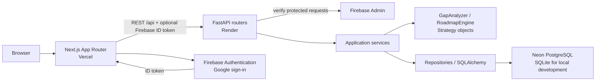
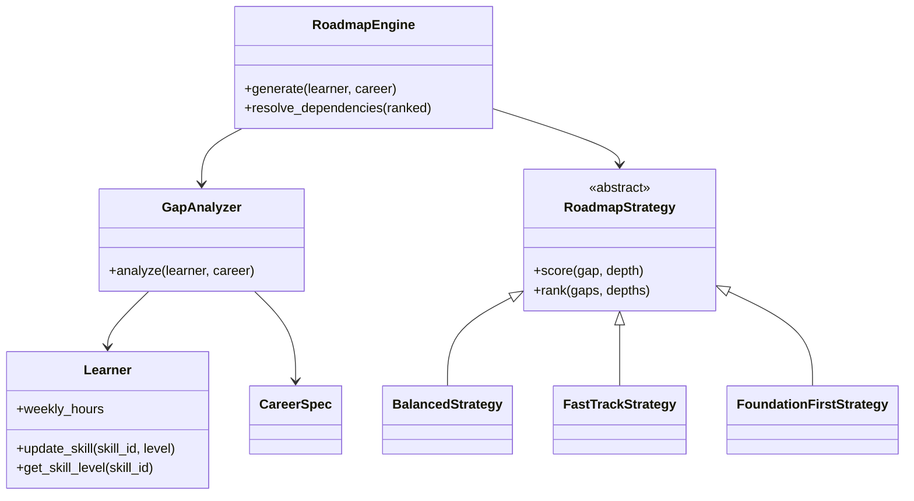
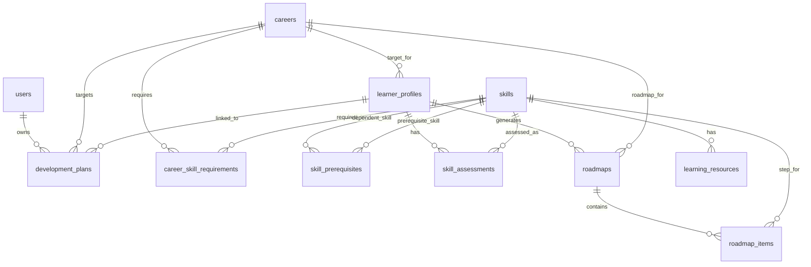
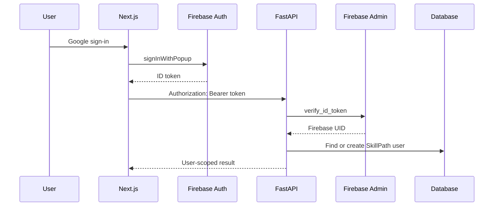
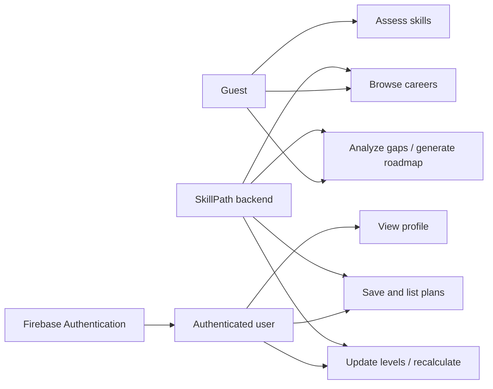

<div align="center">
  

  <h1>SkillPath</h1>
  <p><strong>Personalized Career Readiness &amp; Learning Roadmap System</strong></p>
  <p>Explore a career, assess your skills, and follow a learning path built from actual skill requirements and prerequisites.</p>
</div>

<div align="center">
  
  
  
  
  
  
  
  
  
</div>

## Live deployment

| Service | Link |
| --- | --- |
| Web app on Vercel | [skill-path-cyan.vercel.app](https://skill-path-cyan.vercel.app/) |
| FastAPI on Render | [skillpath-api-si3b.onrender.com](https://skillpath-api-si3b.onrender.com) |
| Swagger / OpenAPI | [API documentation](https://skillpath-api-si3b.onrender.com/docs) |

The backend also defines `GET /health`, which returns `{"status":"ok"}`. These deployment URLs are project-provided; live availability was not established during this documentation update.

## What SkillPath does

SkillPath helps students and early-career learners turn a target career into a concrete study plan. The seeded catalog contains **15 careers**, each with required skills and importance levels. A learner records current skill levels from **0 to 5**. The backend calculates career readiness and skill gaps, orders missing skills by strategy while respecting prerequisites, and estimates study time from weekly availability. Signing in with Google lets a learner save a development plan and return to its progress later.

```mermaid
flowchart LR
  Home["Home /"] --> Careers["Explore careers /careers"]
  Careers --> Detail["Career detail /careers/[id]"]
  Detail --> Assessment["Assess skills /assessment/[careerId]"]
  Assessment --> Analysis["Readiness and gaps /analysis"]
  Analysis --> Roadmap["Generate roadmap /roadmap"]
  Roadmap --> Dashboard["Progress /dashboard"]
  Roadmap --> Login["Google sign-in /login"]
  Login --> Save["Save plan /my-plans/save"]
  Save --> Plans["My Plans /my-plans"]
  Plans --> Workspace["Plan workspace /my-plans/[id]"]
  Workspace --> Update["Update skill levels"]
  Update --> Recalculate["Recalculate plan"]
```



### Implemented features

| Area | Current behavior |
| --- | --- |
| Career explorer | Browse 15 seeded careers by category; inspect requirements and top skills. |
| Assessment and analysis | Record 0–5 levels, calculate importance-weighted readiness, gaps, and priority scores. |
| Roadmap | Choose Balanced, Fast Track, or Foundation First; preserve prerequisite order and estimate weeks. |
| Visualization | View prerequisite nodes and edges in React Flow, with a list view and resource details. |
| Progress | Update roadmap items and assessments, then recalculate the remaining path. |
| Account and plans | Google sign-in, profile, saved development plans, and plan progress. |

## System architecture



Routers handle HTTP and Pydantic contracts. Services coordinate use cases, persistence, and conversion to pure domain objects. The domain layer calculates readiness and learning order without FastAPI or SQLAlchemy. Repositories load and save SQLAlchemy models. The saved-plan service also queries SQLAlchemy directly for career, profile, and assessment data.

## Frontend

The frontend uses Next.js 15 App Router, React 19, TypeScript, CSS, and Thai/English copy. `frontend/lib/api.ts` centralizes the backend origin from `NEXT_PUBLIC_API_URL`, adds `/api`, sends the current Firebase ID token when signed in, and refreshes it once after a 401. `AuthProvider` tracks sign-in state; the Firebase client initializes one app instance. Guest assessment context is kept in browser storage until a plan is saved.

`RoadmapPageClient` loads roadmap data, while `RoadmapGraph` uses React Flow and Dagre for layout. Shared controls live in `components/ui.tsx`; skill logos combine Simple Icons and Lucide fallbacks. The home page includes a pointer field, text reveal, career role display, and pauseable logo marquee. CSS provides a navy/blue/cyan design, responsive breakpoints, focus styles, and reduced-motion behavior. See [the UI design specification](docs/DESIGN.md) for the design rationale.

| Route | Purpose |
| --- | --- |
| `/` | Home and career preview |
| `/careers` | Career explorer |
| `/careers/[id]` | Career requirements |
| `/assessment/[careerId]` | Skill assessment |
| `/analysis` | Readiness and gap analysis |
| `/roadmap` | Roadmap, graph/list view, progress |
| `/dashboard` | Current roadmap summary |
| `/login` | Google sign-in |
| `/profile` | Signed-in user profile |
| `/my-plans` | Saved plan list |
| `/my-plans/save` | Save handoff after sign-in |
| `/my-plans/[id]` | Saved plan workspace |

## Backend and OOAD

The backend uses FastAPI, Pydantic, SQLAlchemy, and independent Python domain objects:

| Layer | Representative code | Responsibility |
| --- | --- | --- |
| HTTP | `app/routers/api.py`, `users.py`, `plans.py` | Routes, auth dependencies, response contracts |
| Services | `services/services.py`, `plan_service.py` | Use-case orchestration and serialization |
| Domain | `domain/entities.py`, `gap_analyzer.py`, `roadmap_engine.py` | Validated learner/career values and deterministic algorithms |
| Strategies | `domain/strategies/` | Interchangeable roadmap ranking |
| Repositories | `repositories/` | SQLAlchemy queries and persistence |
| Models / schemas | `models/`, `schemas/` | Database relationships and HTTP validation |

`Learner.update_skill` encapsulates level validation. `GapAnalyzer.analyze` and `RoadmapEngine.generate` provide algorithmic abstractions. `RoadmapStrategy` is an abstract base class; three subclasses override `score`, and the engine calls the shared `rank` method polymorphically. Repositories and services separate persistence from application decisions.



For the full class inventory, associations, short source excerpts, and OOAD discussion, see [OOAD & Python Class Diagram](docs/CLASS_DIAGRAM.md).

## Data model

Production uses PostgreSQL; local development can use SQLite. The SQLAlchemy models define 11 tables:



`career_skill_requirements` joins careers and skills with a required level and importance. `skill_prerequisites` stores directed prerequisite edges and minimum levels. `development_plans` links an authenticated user to a career and learner profile. The seed upserts **15 careers, 87 skills, 181 requirements, 88 prerequisite edges, and 16 resources**; its repeated-run behavior is covered by a backend test.

## Deterministic algorithms

For each career requirement, the backend uses:

```text
gap                 = max(required_level - current_level, 0)
skill_readiness     = min(current_level / required_level, 1)
career_readiness    = 100 × sum(skill_readiness × importance) / sum(importance)
dependency_factor   = 1 + min(0.15 × dependent_count, 0.60)
priority_score      = round(gap × importance × dependency_factor, 2)
step_hours          = gap × hours_per_level
estimated_weeks     = sum(step_hours) / weekly_hours
```

Readiness is rounded to one decimal and bounded to 0–100%. If a career has no requirements, the analyzer returns 100%. Priority counts dependents within the selected career requirements. The engine filters completed skills, computes dependency depth with cycle detection, ranks remaining gaps using a strategy, then applies a stable topological sort so prerequisites still come first. Start/end weeks accumulate scheduled hours.

| Strategy | Actual ranking score | Emphasis |
| --- | --- | --- |
| Balanced | `priority + 1.5 × depth - 0.35 × difficulty` | Priority with a moderate depth preference and effort penalty |
| Fast Track | `3 × importance + 1.5 × gap - 0.1 × hours_per_level` | Important, larger gaps and shorter per-level effort |
| Foundation First | `priority - 10 × depth` | Earlier prerequisite layers |

Updating a roadmap item can also update the matching assessment. Recalculation runs the engine again for the same profile, career, and strategy; it preserves status for skills that remain in the generated roadmap. A saved plan's `/progress` endpoint recalculates its current readiness and marks it completed when readiness reaches 100%.

## Authentication and security



The frontend does not choose a plan's `user_id`. `get_current_user` verifies the Firebase token and maps its UID to a local user, creating or updating that row. Plan queries filter by the authenticated user; another user's plan returns 404. Once a guest profile is attached to a saved plan, profile and roadmap routes also require the owner token. CORS uses configured allowed origins, while Firebase Admin credentials stay on the backend. The mock verifier is used only in tests/development test mode, not production.

**Boundary:** Unlinked guest profiles use numeric IDs and remain accessible through the guest API. Do not treat an unsaved guest assessment as private account data.

## API

Base: [Render API](https://skillpath-api-si3b.onrender.com) · [Swagger / OpenAPI](https://skillpath-api-si3b.onrender.com/docs). `/api` prefixes application routes; `/health` is separate. “Conditional” means a guest resource is open until its profile is linked to a saved plan, after which its owner token is required.

| Method | Endpoint | Auth | Purpose |
| --- | --- | --- | --- |
| GET | `/health` | No | Health response |
| GET | `/api/careers` | No | Career catalog |
| GET | `/api/careers/{career_id}` | No | Requirements and details |
| GET | `/api/skills` | No | Skills and prerequisites |
| GET | `/api/skills/{skill_id}/resources` | No | Learning resources |
| POST | `/api/profiles` | No | Create learner profile |
| GET, PUT | `/api/profiles/{profile_id}` | Conditional | Read/update profile |
| POST | `/api/profiles/{profile_id}/assessments` | Conditional | Save skill levels |
| GET | `/api/profiles/{profile_id}/analysis` | Conditional | Readiness and gaps |
| POST | `/api/roadmaps/generate` | Conditional | Generate roadmap |
| GET | `/api/roadmaps/{roadmap_id}` | Conditional | Roadmap steps |
| GET | `/api/roadmaps/{roadmap_id}/graph` | Conditional | Nodes, edges, status |
| PATCH | `/api/roadmap-items/{item_id}` | Conditional | Update item/skill level |
| POST | `/api/roadmaps/{roadmap_id}/recalculate` | Conditional | Rebuild remaining path |
| GET, PUT | `/api/users/me` | Bearer | Read/update current user |
| POST, GET | `/api/plans` | Bearer | Create/list saved plans |
| GET, PUT, DELETE | `/api/plans/{plan_id}` | Bearer + owner | Read/update/delete plan |
| POST | `/api/plans/{plan_id}/progress` | Bearer + owner | Update plan readiness |

Example public request:

```bash
curl https://skillpath-api-si3b.onrender.com/api/careers
```

A career list item contains `id`, `title`, `description`, `category`, `required_skill_count`, and `top_skills`. Example authenticated plan creation, using placeholder IDs and token:

```http
POST /api/plans
Authorization: Bearer <FIREBASE_ID_TOKEN>
Content-Type: application/json

{"name":"Frontend study plan","career_id":1,"learner_profile_id":2,"strategy":"balanced","weekly_hours":8}
```

The response is a `DevelopmentPlanResponse` with the generated plan ID, owner ID, linked profile, readiness values, status, and timestamps. Progress can be refreshed with `POST /api/plans/{plan_id}/progress` using the same bearer header.

## Use cases



| Actor | Use case | Result |
| --- | --- | --- |
| Guest | Explore and assess | A profile, analysis, and roadmap can be created without sign-in. |
| Authenticated user | Save a development plan | The plan is attached to the verified local user. |
| Authenticated user | Return and update progress | Saved plan and assessments are read, updated, and recalculated. |

## Software Requirements Specification (SRS)

| ID | Functional requirement | Implemented by |
| --- | --- | --- |
| FR-01 | Browse careers and requirements | Career router/service |
| FR-02 | Record 0–5 skill levels | Assessment schema and profile service |
| FR-03 | Calculate weighted readiness and gaps | `GapAnalyzer` |
| FR-04 | Generate prerequisite-aware strategy roadmaps | `RoadmapEngine` and strategies |
| FR-05 | Track skill progress and recalculate | Roadmap and plan services |
| FR-06 | Sign in with Google and verify tokens | Firebase client/Admin |
| FR-07 | Save and manage personal plans | Plan router/service |
| FR-08 | Restrict saved resources to their owner | Auth dependency and ownership checks |

| ID | Non-functional requirement | Implementation evidence |
| --- | --- | --- |
| NFR-01 | Security | Server token validation, CORS allowlist, owner checks |
| NFR-02 | Responsive access | CSS breakpoints and graph/list views |
| NFR-03 | Maintainability | Distinct router, service, domain, and persistence layers |
| NFR-04 | Usability | Loading, empty, error, keyboard focus, and reduced-motion styles |
| NFR-05 | Deployment reliability | Environment checks, health route, separate frontend/backend deployment guide |

## Testing

The backend suite uses pytest and FastAPI TestClient, including parameterized career and strategy cases. It covers formulas, dependency order/cycles, seed integrity, API flows, token handling with a mock verifier, CORS preflight, plan ownership, progress completion, and production configuration. There is no frontend test runner or lint script in `frontend/package.json`.

| Area | Command | Result during this update |
| --- | --- | --- |
| Backend | `cd backend; python -m pytest -q` | **44 passed** (one Starlette/httpx deprecation warning) |
| Frontend types | `cd frontend; npm run typecheck` | **Passed** |
| Frontend production | `cd frontend; npm run build` | **Passed** (workspace-root lockfile warning) |

| Representative test case | Expected / asserted result |
| --- | --- |
| Missing token on `/api/users/me` | Rejected |
| Invalid token | 401 |
| First valid mock token | Local user created |
| User B requests User A's saved plan or linked profile | 404 |
| Completed skill level and plan progress refresh | Plan reaches `COMPLETED` |
| Prerequisite cycle in domain input | `DependencyCycleError` |
| Seed run again | No duplicate career/skill/edge keys |

## Local development

Use Python 3.13 and a Node version compatible with Next.js 15. On Windows PowerShell, from the repository root:

```powershell
cd backend
python -m venv .venv
.venv\Scripts\Activate.ps1
python -m pip install -r requirements.txt
python -m app.seed
uvicorn app.main:app --reload
```

The backend defaults to local SQLite in development. In a second terminal:

```powershell
cd frontend
npm install
npm run dev
```

Open `http://localhost:3000`; local API docs are at `http://127.0.0.1:8000/docs`. Create `frontend/.env.local` with `NEXT_PUBLIC_API_URL=http://127.0.0.1:8000` and the six Firebase web variables if testing Google sign-in. Set backend variables in your environment or `backend/.env`. No `.env.example` files are currently present in this checkout.

| Frontend variable | Purpose |
| --- | --- |
| `NEXT_PUBLIC_API_URL` | Backend origin, without `/api` |
| `NEXT_PUBLIC_FIREBASE_API_KEY`, `NEXT_PUBLIC_FIREBASE_AUTH_DOMAIN`, `NEXT_PUBLIC_FIREBASE_PROJECT_ID` | Firebase web app configuration |
| `NEXT_PUBLIC_FIREBASE_STORAGE_BUCKET`, `NEXT_PUBLIC_FIREBASE_MESSAGING_SENDER_ID`, `NEXT_PUBLIC_FIREBASE_APP_ID` | Remaining Firebase web app configuration |

| Backend variable | Purpose |
| --- | --- |
| `ENVIRONMENT` | `development` or `production` |
| `DATABASE_URL` | PostgreSQL in production; SQLite fallback locally |
| `FIREBASE_PROJECT_ID` | Firebase Admin project ID |
| `GOOGLE_APPLICATION_CREDENTIALS` | Server-side service account path |
| `CORS_ORIGINS` | Comma-separated allowed frontend origins |

Keep Admin credentials and database passwords out of the frontend and Git. For provider setup, TLS, seeding, authorized domains, and redeployment, see [the deployment guide](docs/DEPLOYMENT.md).

## Project structure and key files

```text
SkillPath/
├── frontend/
│   ├── app/                 Next.js routes and styles
│   ├── components/          UI, home motion, roadmap graph
│   ├── lib/                 API client, types, icon registry, graph layout
│   ├── providers/           AuthProvider
│   └── public/images/       SkillPath logo
├── backend/
│   ├── app/
│   │   ├── auth/            Firebase token verifier
│   │   ├── core/            Settings and database
│   │   ├── domain/          Pure entities, analyzer, engine, strategies
│   │   ├── models/          SQLAlchemy tables
│   │   ├── repositories/    Persistence
│   │   ├── routers/         HTTP endpoints
│   │   ├── schemas/         Pydantic contracts
│   │   ├── services/        Use cases
│   │   └── seed.py          Catalog seed
│   └── tests/               pytest suite
├── docs/                    Product, design, deployment, OOAD docs
└── README.md
```

| Path | Purpose |
| --- | --- |
| `frontend/app/page.tsx` | Home route |
| `frontend/components/roadmap/RoadmapPageClient.tsx` | Roadmap interaction |
| `frontend/lib/api.ts` | Central API requests and Firebase bearer token |
| `frontend/lib/firebase/client.ts` | Firebase web initialization |
| `frontend/providers/AuthProvider.tsx` | Sign-in state |
| `backend/app/main.py` | FastAPI setup, CORS, health |
| `backend/app/core/database.py` | Engine, sessions, schema initialization |
| `backend/app/domain/gap_analyzer.py` | Readiness, gap, priority |
| `backend/app/domain/roadmap_engine.py` | Ordering and scheduling |
| `backend/app/services/services.py` | Career, profile, analysis, roadmap use cases |
| `backend/app/services/plan_service.py` | Saved-plan use cases and ownership |
| `backend/app/auth/verifier.py` | Firebase Admin token verification |
| `backend/app/seed.py` | Catalog seed |

## Documentation

- [Product specification](docs/Document.md)
- [Frontend design specification](docs/DESIGN.md)
- [Deployment guide](docs/DEPLOYMENT.md)
- [OOAD & Python Class Diagram](docs/CLASS_DIAGRAM.md)

## Current limits

The seed is a demonstration catalog, and study-hour estimates are planning estimates. Guest profiles are not private until linked to an authenticated plan. The repository does not include automated frontend interaction tests or a database migration framework.
