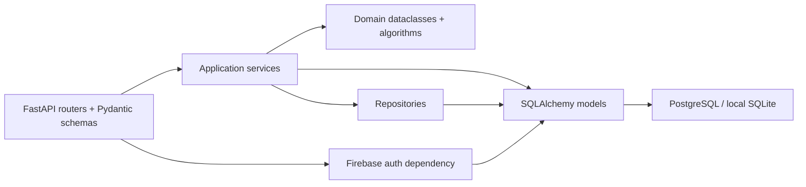
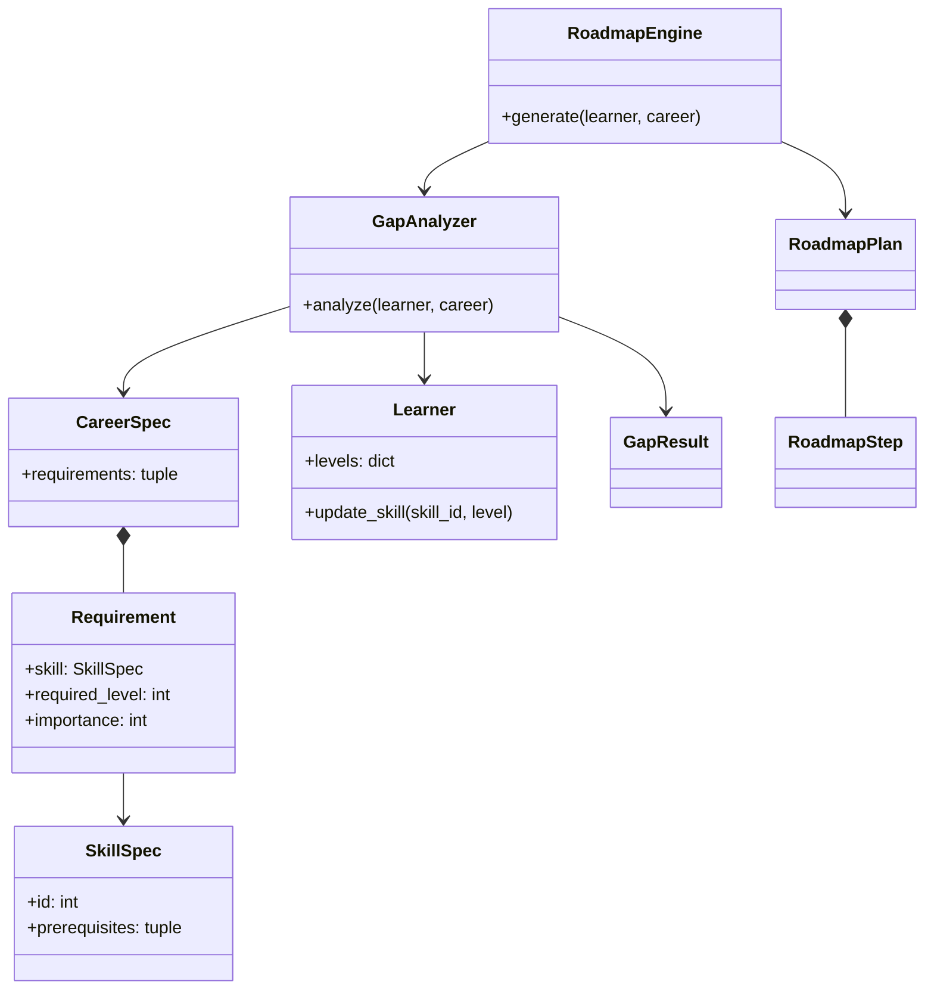
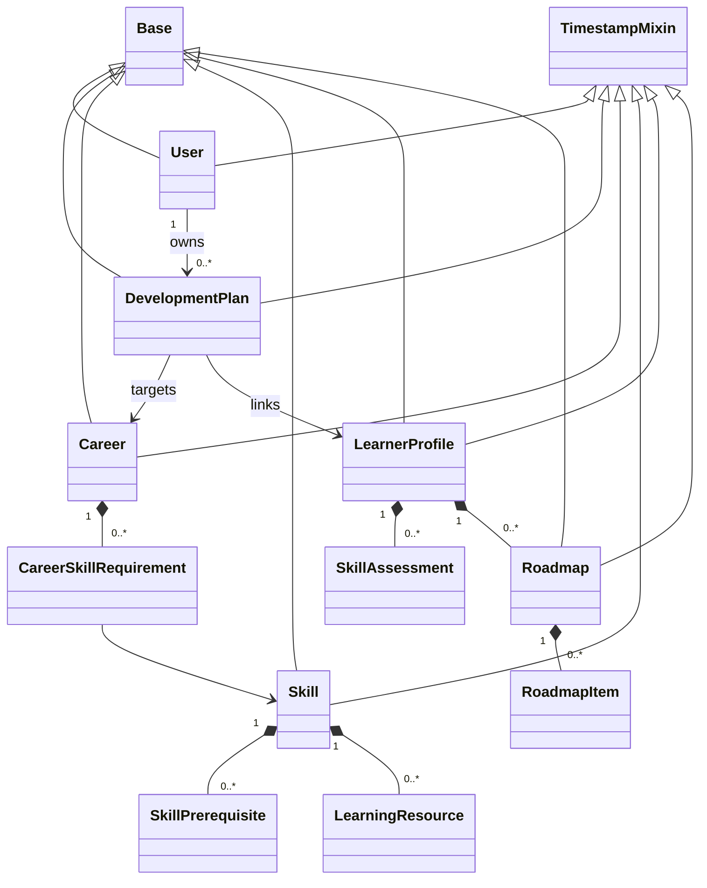
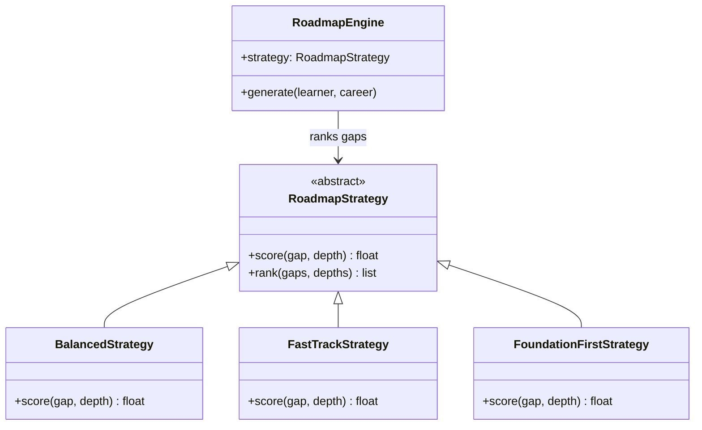
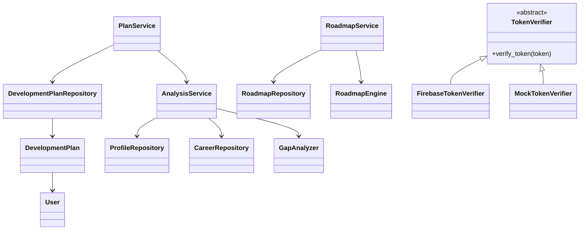
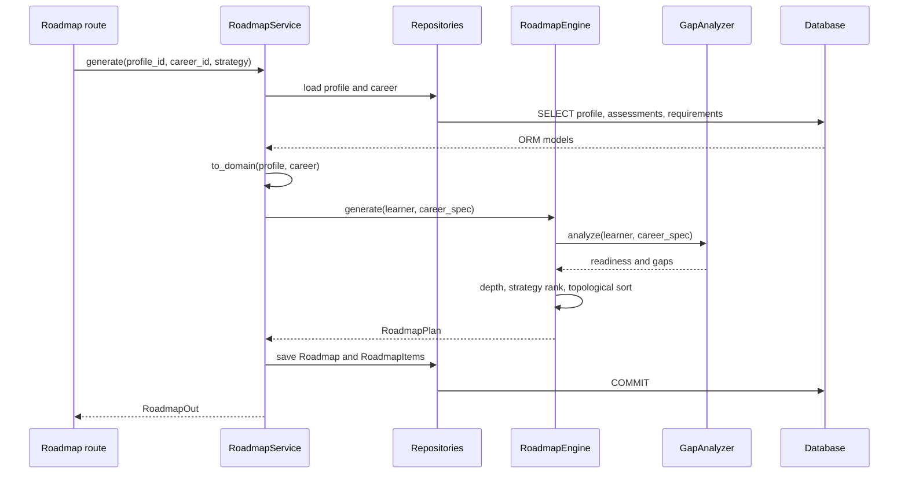

# SkillPath — OOAD & Python Class Diagram

SkillPath separates persisted entities, validated domain values, business algorithms, data access, application services, and HTTP contracts. This document describes the **current Python implementation** in `backend/app/`. It distinguishes in-memory domain classes from SQLAlchemy models because they serve different purposes.

## Layer map



| Layer | Location | Design decision |
| --- | --- | --- |
| HTTP / validation | `routers/`, `schemas/` | Routes choose use cases; Pydantic validates request and response shapes. |
| Application services | `services/` | Coordinate repositories, domain conversion, calculations, and transactions. |
| Domain | `domain/` | Represent a learner and career independently of HTTP and SQLAlchemy. |
| Repositories | `repositories/` | Encapsulate common loads and saves with SQLAlchemy sessions. |
| Persistence | `models/`, `core/database.py` | Store relational data and manage sessions. |
| Authentication | `auth/` | Verify Firebase tokens and map the Firebase UID to a local `User`. |

The dependency direction is mostly inward from router to service to domain/repository. `PlanService` also queries SQLAlchemy models directly; the code is not a strict repository-only architecture.

## Python class inventory

### Domain values and algorithms

| Class | File | Responsibility |
| --- | --- | --- |
| `SkillSpec` | `domain/entities.py` | Immutable skill ID, difficulty, study hours, prerequisite IDs; validates difficulty and hours. |
| `Requirement` | `domain/entities.py` | Immutable required level and importance for a `SkillSpec`; validates 1–5 bounds. |
| `CareerSpec` | `domain/entities.py` | Immutable career and requirement tuple supplied to analysis. |
| `Learner` | `domain/entities.py` | Mutable learner levels and weekly hours; validates levels and study time. |
| `GapResult` | `domain/entities.py` | Immutable analysis result per skill. |
| `RoadmapStep` | `domain/entities.py` | Immutable scheduled skill step. |
| `RoadmapPlan` | `domain/entities.py` | Immutable generated readiness, total weeks, and step tuple. |
| `GapAnalyzer` | `domain/gap_analyzer.py` | Calculates gap, readiness, dependency-weighted priority, and career score. |
| `RoadmapEngine` | `domain/roadmap_engine.py` | Computes depths, enforces dependency order, and schedules steps. |
| `DependencyCycleError` | `domain/roadmap_engine.py` | Signals a cycle in a skill dependency graph. |
| `RoadmapStrategy` | `domain/strategies/base.py` | Abstract scoring contract and common ranking method. |
| `BalancedStrategy` | `domain/strategies/balanced.py` | Scores priority with depth and difficulty adjustment. |
| `FastTrackStrategy` | `domain/strategies/fast_track.py` | Scores importance, gap size, and per-level effort. |
| `FoundationFirstStrategy` | `domain/strategies/foundation_first.py` | Penalizes deeper skills to favor foundations. |

### SQLAlchemy persistence models

| Class | Table / file | Main relationships or behavior |
| --- | --- | --- |
| `Base` | `core/database.py` | Declarative SQLAlchemy base. |
| `TimestampMixin` | `models/entities.py` | Shared `created_at` and `updated_at` mapped columns. |
| `Skill` | `skills` · `models/entities.py` | Resources and prerequisites; `estimate_learning_hours` validates 0–5 levels. |
| `Career` | `careers` · `models/entities.py` | Collection of `CareerSkillRequirement` rows. |
| `CareerSkillRequirement` | `career_skill_requirements` · `models/entities.py` | Joins career and skill with level and importance; unique pair. |
| `SkillPrerequisite` | `skill_prerequisites` · `models/entities.py` | Directed skill-to-prerequisite edge and minimum level; unique pair. |
| `LearnerProfile` | `learner_profiles` · `models/entities.py` | Target career, weekly hours, assessments, and roadmaps. |
| `SkillAssessment` | `skill_assessments` · `models/entities.py` | One current level per profile/skill pair. |
| `LearningResource` | `learning_resources` · `models/entities.py` | Resource belonging to a skill. |
| `Roadmap` | `roadmaps` · `models/entities.py` | Persisted profile/career/strategy and ordered items. |
| `RoadmapItem` | `roadmap_items` · `models/entities.py` | Persisted scheduled skill step and progress status. |
| `User` | `users` · `models/user.py` | Firebase UID, profile fields, and owned plans. |
| `DevelopmentPlan` | `development_plans` · `models/development_plan.py` | User-owned plan linked to career and learner profile. |

The `SkillSpec` domain value and `Skill` ORM row are different classes. Similarly, `RoadmapPlan` is a generated domain result, while `Roadmap` and `DevelopmentPlan` are persisted records.

### Services, repositories, and authentication

| Class | File | Responsibility |
| --- | --- | --- |
| `CareerRepository` | `repositories/repositories.py` | Load catalog careers and eager requirements. |
| `SkillRepository` | `repositories/repositories.py` | Load skills, prerequisites, and resources. |
| `ProfileRepository` | `repositories/repositories.py` | Load/save learner profiles and assessments. |
| `RoadmapRepository` | `repositories/repositories.py` | Load/save roadmap graph data and items. |
| `DevelopmentPlanRepository` | `repositories/plan_repository.py` | Create, query, update, and delete saved plans. |
| `CareerService` | `services/services.py` | Serialize career summaries/details. |
| `SkillService` | `services/services.py` | Serialize skills and resources. |
| `ProfileService` | `services/services.py` | Create/update profiles and upsert assessments. |
| `AnalysisService` | `services/services.py` | Convert ORM data to domain values and run `GapAnalyzer`. |
| `RoadmapService` | `services/services.py` | Generate/persist roadmaps, build graph views, update items, recalculate. |
| `PlanService` | `services/plan_service.py` | Save/list/update/delete owner-scoped plans and refresh readiness. |
| `TokenVerifier` | `auth/verifier.py` | Abstract token-verification interface. |
| `FirebaseTokenVerifier` | `auth/verifier.py` | Verify Firebase ID tokens with Firebase Admin. |
| `MockTokenVerifier` | `auth/verifier.py` | Test-only deterministic token verifier. |
| `Settings` | `core/config.py` | Validate environment, database URL, and CORS settings. |

The `schemas/api.py`, `schemas/user.py`, and `schemas/development_plan.py` files also define Pydantic classes such as `ProfileCreate`, `AnalysisOut`, `RoadmapGraphOut`, `UserResponse`, and `DevelopmentPlanResponse`. They describe HTTP payloads; they are not ORM tables or business objects.

## 1. Domain and persistence relationships



The domain dataclasses are constructed from ORM data by `to_domain` in `services/services.py`. Requirements include only prerequisites relevant to the selected career. The analyzer returns readiness and one `GapResult` per requirement. The engine builds `RoadmapStep` objects from unmet requirements.



`Base` is the SQLAlchemy declarative base; `TimestampMixin` supplies shared mapped columns, not a database table. Several association rows are subclasses of `Base` without `TimestampMixin`. The database foreign keys and unique constraints are in `models/entities.py` and `models/development_plan.py`.

## 2. Roadmap Strategy pattern



The abstract class defines the scoring hook, and its inherited `rank` method sorts by descending score with a skill-name tie break. `RoadmapService.generate` selects a class from the `STRATEGIES` dictionary and passes an instance into `RoadmapEngine`.

Actual excerpt from `domain/strategies/base.py`:

```python
class RoadmapStrategy(ABC):
    @abstractmethod
    def score(self, gap: GapResult, depth: int) -> float:
        """Return a higher score for skills that should be learned sooner."""

    def rank(self, gaps: list[GapResult], depths: dict[int, int]) -> list[GapResult]:
        return sorted(gaps, key=lambda item: (-self.score(item, depths.get(item.skill.id, 0)), item.skill.name))
```

| Concrete strategy | Implemented score | Design intent |
| --- | --- | --- |
| `BalancedStrategy` | `priority_score + 1.5 × depth - 0.35 × difficulty` | Mix priority, depth, and effort. |
| `FastTrackStrategy` | `3 × importance + 1.5 × gap - 0.1 × hours_per_level` | Favor important, larger gaps. |
| `FoundationFirstStrategy` | `priority_score - 10 × depth` | Favor earlier dependency layers. |

Strategy ranking is followed by a stable topological sort. A high-scoring skill cannot be scheduled before one of its unmet prerequisites.

## 3. Services, repositories, and authentication



`get_current_user` in `auth/dependencies.py` is a **function**, not a class. It uses the configured `TokenVerifier`, then finds or creates a local `User` by Firebase UID. Plan routes inject that user and pass `user.id` into `PlanService`. The frontend request body never chooses the owner. `PlanService.get_plan` rejects a plan whose `user_id` differs from the verified user. The guest API checks ownership again after a profile is linked to a saved plan.

Actual excerpt from `services/plan_service.py`:

```python
def get_plan(self, user_id: int, plan_id: int) -> DevelopmentPlan:
    plan = self.repo.get_by_id(plan_id)
    if not plan or plan.user_id != user_id:
        raise HTTPException(status_code=404, detail="Plan not found")
```

The method continues with assessment initialization for a linked profile that has no assessments; the excerpt shows the ownership gate. `DevelopmentPlanRepository.get_by_user_id` filters the saved-plan list by `user_id`.

## OOP and OOAD decisions

| Principle / pattern | Concrete implementation |
| --- | --- |
| Encapsulation | `Learner.update_skill` validates 0–5 before changing its `levels` dictionary; `Skill.estimate_learning_hours` validates input levels. |
| Abstraction | `GapAnalyzer.analyze` returns readiness and gap results; `RoadmapEngine.generate` returns a plan without exposing sorting details to callers. |
| Inheritance | Three roadmap strategies inherit `RoadmapStrategy`; ORM models inherit `Base` and some use `TimestampMixin`. |
| Polymorphism | `RoadmapEngine` invokes `strategy.rank`; inherited ranking calls the concrete subclass's `score`. |
| Strategy pattern | `STRATEGIES` maps request names to interchangeable strategy classes. |
| Repository pattern | Repository objects group common SQLAlchemy reads and writes. |
| Service layer | Services coordinate repositories, domain conversion, persistence, and response serialization. |
| Domain model | Pure dataclasses describe the learner, career requirements, gaps, and generated plan without database coupling. |

Actual excerpt from `domain/entities.py`:

```python
def update_skill(self, skill_id: int, level: int) -> None:
    validate_level(level)
    self.levels[skill_id] = level
```

The immutable domain value classes use `@dataclass(frozen=True)`; `Learner` remains mutable because progress changes. This distinction makes recalculation possible while keeping requirements and computed results stable during one analysis.

## Algorithm collaboration



`GapAnalyzer` calculates `max(required - current, 0)` and `min(current / required, 1)` per skill. Overall readiness is the importance-weighted percentage. Priority is `gap × importance × (1 + min(0.15 × dependent_count, 0.60))`. The engine schedules only unmet skills, calculates dependency depth by DFS, and raises `DependencyCycleError` on a cycle. It then applies the selected strategy and a stable topological sort. Estimated hours for a step are `gap × hours_per_level`; accumulated hours divided by `Learner.weekly_hours` produces start/end weeks and total duration.

When progress changes, `RoadmapService.update_item` updates the roadmap item and its matching assessment. `RoadmapService.recalculate` regenerates the same roadmap with current levels and carries forward statuses for skills still present. `PlanService.update_progress` recalculates a saved plan's readiness and sets `COMPLETED` when it reaches 100%.

## Boundaries and review notes

- `RoadmapPlan` does not persist itself. `RoadmapService` translates its steps into SQLAlchemy `RoadmapItem` rows.
- `DevelopmentPlan` represents a user's saved goal; `Roadmap` represents a generated schedule for a learner profile. They are linked indirectly through `LearnerProfile`.
- Guest profiles are intentionally available before they are linked to a saved plan. The current code checks ownership for linked profiles and roadmaps; an unlinked guest profile is not private account data.
- `Base.metadata.create_all` and a small additive column update initialize the schema. There is no general migration framework.
- The tests in `backend/tests/` exercise domain formulas, dependency order/cycles, API flow, auth, plan ownership, seed idempotency, and deployment configuration.

See the [README](../README.md) for routes, API details, setup, and the broader system diagram.
