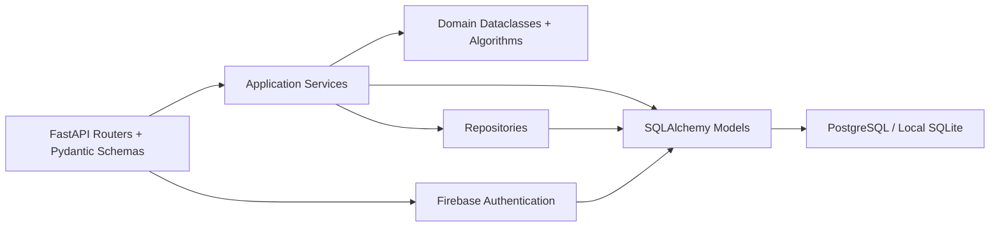
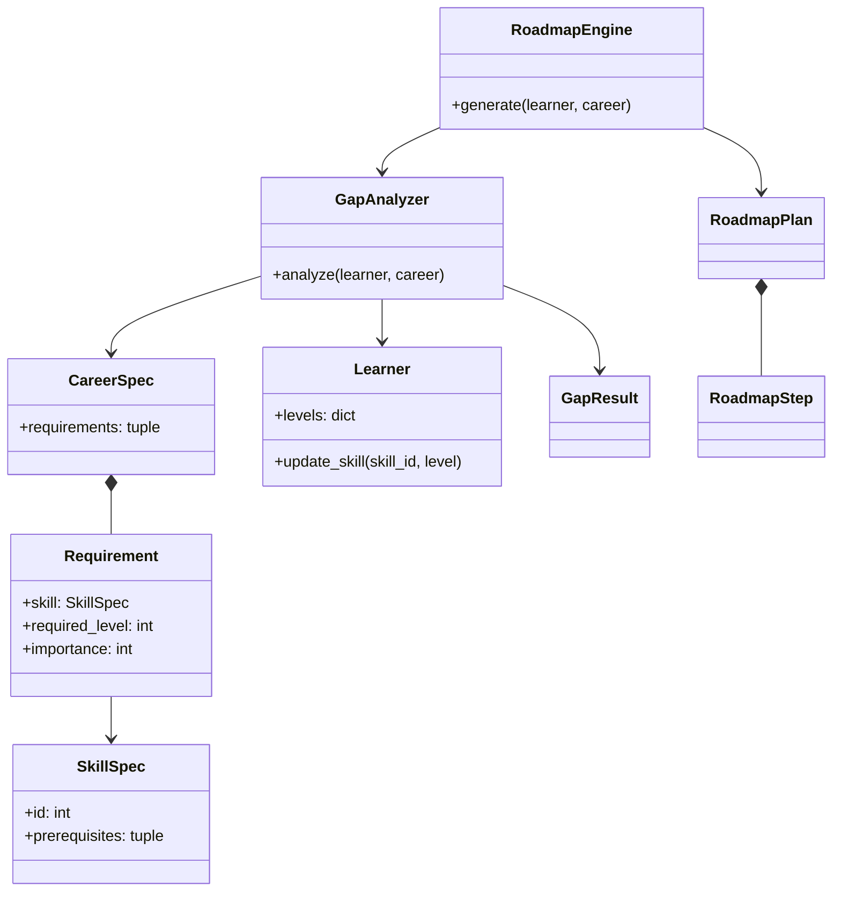
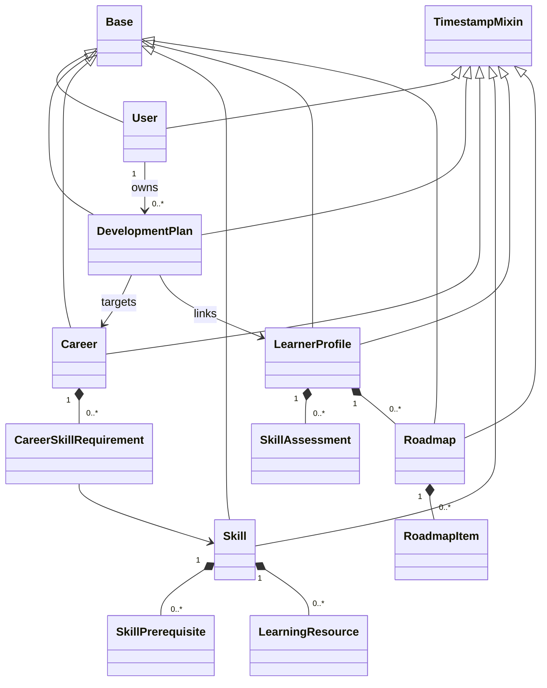
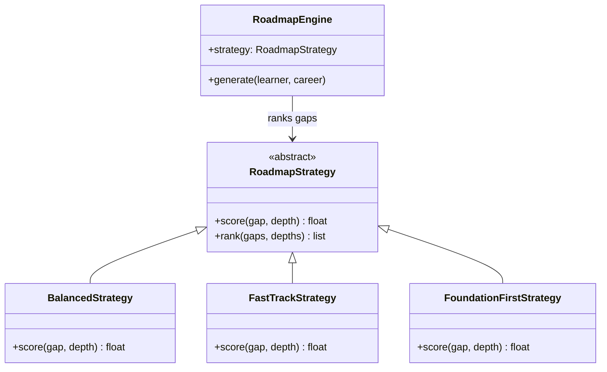
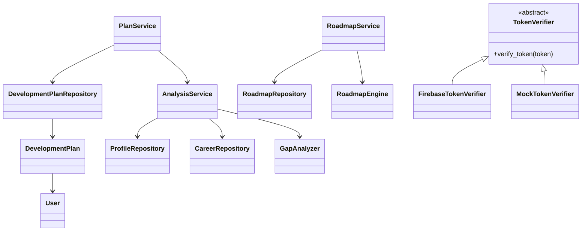
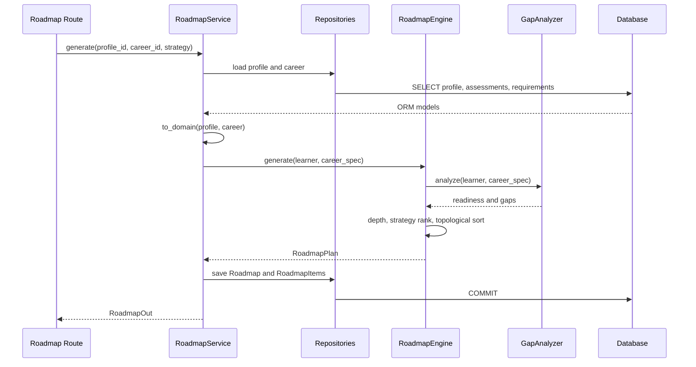

# SkillPath — OOAD และ Python Class Diagram ฉบับอธิบายภาษาไทย

เอกสารนี้อธิบายโครงสร้างปัจจุบันของ **SkillPath ฝั่ง Python Backend** ใน `backend/app/` โดยเน้นแนวคิดด้าน **OOAD (Object-Oriented Analysis and Design)**, Class Diagram, Domain Model, Persistence Model, Service Layer, Repository Pattern, Strategy Pattern และการทำงานร่วมกันของแต่ละส่วน

SkillPath แยกส่วนที่มีหน้าที่แตกต่างกันออกจากกัน ได้แก่

- Entity ที่ถูกบันทึกลงฐานข้อมูล
- Domain Value ที่มี Validation
- Business Algorithm
- Data Access
- Application Service
- HTTP Contract

จุดสำคัญคือ **Domain Class ที่อยู่ในหน่วยความจำ (in-memory)** และ **SQLAlchemy Model ที่แทนข้อมูลในฐานข้อมูล** เป็นคนละ Class กัน เพราะมีหน้าที่แตกต่างกัน

> เอกสารฉบับนี้เป็นการอธิบาย `CLASS_DIAGRAM.md` เป็นภาษาไทย โดยคงชื่อ Class, Method, File, API และศัพท์ Technical ที่จำเป็นไว้ตามต้นฉบับ

---

# 1. โครงสร้าง Layer ของระบบ

สถาปัตยกรรมของ SkillPath สามารถมองภาพรวมได้ดังนี้



## รายละเอียดแต่ละ Layer

| Layer | ตำแหน่ง | แนวคิดในการออกแบบ |
| --- | --- | --- |
| HTTP / Validation | `routers/`, `schemas/` | Route เลือก Use Case และ Pydantic ทำหน้าที่ Validate รูปแบบ Request/Response |
| Application Services | `services/` | ประสาน Repository, Domain Conversion, Calculation และ Transaction |
| Domain | `domain/` | แทนข้อมูล Learner และ Career โดยไม่ผูกกับ HTTP หรือ SQLAlchemy |
| Repositories | `repositories/` | ห่อหุ้มการ Load/Save ข้อมูลที่ทำผ่าน SQLAlchemy Session |
| Persistence | `models/`, `core/database.py` | จัดเก็บข้อมูลเชิงสัมพันธ์และจัดการ Database Session |
| Authentication | `auth/` | ตรวจสอบ Firebase Token และเชื่อม Firebase UID กับ Local `User` |

### ทิศทาง Dependency

โดยทั่วไป Dependency จะไหลเข้าด้านใน:

```text
Router
   ↓
Service
   ↓
Domain / Repository
```

อย่างไรก็ตาม Architecture ในปัจจุบัน **ยังไม่ใช่ Repository-only Architecture แบบเข้มงวด** เพราะ `PlanService` สามารถ Query SQLAlchemy Models โดยตรงได้ด้วย

ดังนั้นไม่ควรอธิบายระบบว่าเป็น Clean Architecture ที่แยก Persistence ออกจาก Service อย่างสมบูรณ์ เพราะ Source Code ปัจจุบันยังมีจุดที่ Service เข้าถึง ORM โดยตรง

---

# 2. รายการ Python Classes

## 2.1 Domain Values และ Business Algorithms

Class กลุ่มนี้เป็นส่วนของ Domain โดยเน้น Business Meaning และ Algorithm มากกว่าการติดต่อ Database

| Class | File | หน้าที่ |
| --- | --- | --- |
| `SkillSpec` | `domain/entities.py` | เก็บ Skill ID, Difficulty, Study Hours และ Prerequisite IDs แบบ Immutable พร้อมตรวจสอบ Difficulty และ Hours |
| `Requirement` | `domain/entities.py` | เก็บ Required Level และ Importance ของ `SkillSpec` แบบ Immutable และตรวจสอบค่าให้อยู่ในช่วง 1–5 |
| `CareerSpec` | `domain/entities.py` | เก็บ Career และชุด Requirement แบบ Immutable เพื่อใช้ในการวิเคราะห์ |
| `Learner` | `domain/entities.py` | เก็บระดับ Skill และ Weekly Hours ของผู้เรียนแบบ Mutable พร้อมตรวจสอบค่าระดับและเวลาเรียน |
| `GapResult` | `domain/entities.py` | ผลการวิเคราะห์ Skill แต่ละรายการแบบ Immutable |
| `RoadmapStep` | `domain/entities.py` | ขั้นตอน Skill ที่ถูกจัดลงใน Roadmap แบบ Immutable |
| `RoadmapPlan` | `domain/entities.py` | ผลลัพธ์ Roadmap ที่สร้างขึ้น ประกอบด้วย Readiness, จำนวนสัปดาห์ทั้งหมด และชุด Step แบบ Immutable |
| `GapAnalyzer` | `domain/gap_analyzer.py` | คำนวณ Skill Gap, Readiness, Priority ที่คำนึงถึง Dependency และ Career Score |
| `RoadmapEngine` | `domain/roadmap_engine.py` | คำนวณ Dependency Depth, บังคับลำดับตาม Dependency และจัดตารางการเรียน |
| `DependencyCycleError` | `domain/roadmap_engine.py` | แจ้งข้อผิดพลาดเมื่อ Dependency Graph มี Cycle |
| `RoadmapStrategy` | `domain/strategies/base.py` | กำหนด Abstract Scoring Contract และ Ranking Method กลาง |
| `BalancedStrategy` | `domain/strategies/balanced.py` | ให้คะแนนโดยผสม Priority, Depth และ Difficulty |
| `FastTrackStrategy` | `domain/strategies/fast_track.py` | ให้คะแนนโดยเน้น Importance, Gap Size และ Effort ต่อ Level |
| `FoundationFirstStrategy` | `domain/strategies/foundation_first.py` | ลงโทษ Skill ที่อยู่ใน Dependency Layer ลึก เพื่อให้ Skill พื้นฐานมาก่อน |

---

# 3. SQLAlchemy Persistence Models

Class กลุ่มนี้เป็นตัวแทนข้อมูลที่ Persist อยู่ใน Database

| Class | Table / File | ความสัมพันธ์หรือพฤติกรรมหลัก |
| --- | --- | --- |
| `Base` | `core/database.py` | Declarative Base ของ SQLAlchemy |
| `TimestampMixin` | `models/entities.py` | จัดเตรียม Column `created_at` และ `updated_at` ที่ใช้ร่วมกัน |
| `Skill` | `skills` · `models/entities.py` | เก็บ Resource และ Prerequisite และมี `estimate_learning_hours` สำหรับตรวจสอบระดับ 0–5 |
| `Career` | `careers` · `models/entities.py` | เก็บ Collection ของ `CareerSkillRequirement` |
| `CareerSkillRequirement` | `career_skill_requirements` · `models/entities.py` | เชื่อม Career กับ Skill พร้อม Level และ Importance และกำหนด Unique Pair |
| `SkillPrerequisite` | `skill_prerequisites` · `models/entities.py` | เก็บ Directed Skill-to-Prerequisite Edge และ Minimum Level พร้อม Unique Pair |
| `LearnerProfile` | `learner_profiles` · `models/entities.py` | เก็บ Career เป้าหมาย, Weekly Hours, Assessments และ Roadmaps |
| `SkillAssessment` | `skill_assessments` · `models/entities.py` | เก็บ Current Level หนึ่งค่าต่อ Profile/Skill Pair |
| `LearningResource` | `learning_resources` · `models/entities.py` | Resource ที่อยู่ภายใต้ Skill |
| `Roadmap` | `roadmaps` · `models/entities.py` | Roadmap ที่บันทึก Profile, Career, Strategy และ Ordered Items |
| `RoadmapItem` | `roadmap_items` · `models/entities.py` | Skill Step ที่ถูก Schedule พร้อม Progress Status |
| `User` | `users` · `models/user.py` | เก็บ Firebase UID, Profile Fields และ Plans ที่ User เป็นเจ้าของ |
| `DevelopmentPlan` | `development_plans` · `models/development_plan.py` | Plan ที่ User เป็นเจ้าของ และเชื่อมกับ Career และ Learner Profile |

### ความแตกต่างระหว่าง Domain กับ Persistence

`SkillSpec` และ `Skill` **ไม่ใช่ Class เดียวกัน**

- `SkillSpec` = Domain Value ที่ใช้ใน Business Logic
- `Skill` = SQLAlchemy ORM Row ที่ใช้เก็บข้อมูลใน Database

เช่นเดียวกัน

- `RoadmapPlan` = ผลลัพธ์ที่สร้างขึ้นใน Domain
- `Roadmap` = Record ที่ถูกบันทึกใน Database
- `DevelopmentPlan` = Saved Plan ของ User

การแยกนี้ช่วยให้ Business Logic ไม่จำเป็นต้องผูกติดกับ Database Model โดยตรง

---

# 4. Services, Repositories และ Authentication

## 4.1 Service และ Repository Classes

| Class | File | หน้าที่ |
| --- | --- | --- |
| `CareerRepository` | `repositories/repositories.py` | Load Career Catalog และ Requirements แบบ Eager Loading |
| `SkillRepository` | `repositories/repositories.py` | Load Skill, Prerequisite และ Resource |
| `ProfileRepository` | `repositories/repositories.py` | Load และ Save Learner Profile รวมถึง Assessment |
| `RoadmapRepository` | `repositories/repositories.py` | Load และ Save Roadmap Graph Data และ Items |
| `DevelopmentPlanRepository` | `repositories/plan_repository.py` | Create, Query, Update และ Delete Saved Plans |
| `CareerService` | `services/services.py` | Serialize Career Summary และ Detail |
| `SkillService` | `services/services.py` | Serialize Skill และ Resource |
| `ProfileService` | `services/services.py` | สร้าง/แก้ไข Profile และ Upsert Assessment |
| `AnalysisService` | `services/services.py` | แปลง ORM Data เป็น Domain Values และเรียก `GapAnalyzer` |
| `RoadmapService` | `services/services.py` | สร้าง/บันทึก Roadmap, สร้าง Graph View, Update Item และ Recalculate |
| `PlanService` | `services/plan_service.py` | Save/List/Update/Delete Plan ตาม Ownership และ Refresh Readiness |
| `TokenVerifier` | `auth/verifier.py` | Abstract Interface สำหรับตรวจสอบ Token |
| `FirebaseTokenVerifier` | `auth/verifier.py` | ตรวจสอบ Firebase ID Token ผ่าน Firebase Admin |
| `MockTokenVerifier` | `auth/verifier.py` | Token Verifier สำหรับ Test โดยเฉพาะ |
| `Settings` | `core/config.py` | ตรวจสอบ Environment, Database URL และ CORS Settings |

## Pydantic Schemas

ไฟล์ต่อไปนี้ยังมี Pydantic Classes เช่น

- `schemas/api.py`
- `schemas/user.py`
- `schemas/development_plan.py`

ตัวอย่าง Class ได้แก่

- `ProfileCreate`
- `AnalysisOut`
- `RoadmapGraphOut`
- `UserResponse`
- `DevelopmentPlanResponse`

Class เหล่านี้ทำหน้าที่เป็น **HTTP Payload Contract**

ดังนั้นไม่ควรจัดให้เป็น

- ORM Table
- Database Entity
- Business Domain Object

เพราะหน้าที่หลักคือกำหนดรูปแบบข้อมูลที่เข้าและออกจาก HTTP API

---

# 5. ความสัมพันธ์ระหว่าง Domain และ Persistence

## 5.1 Domain Model



### การทำงานของ Domain

`SkillSpec` เป็นข้อมูลพื้นฐานของ Skill

`Requirement` บอกว่า Career หนึ่งต้องการ Skill นั้นในระดับเท่าไร และมี Importance เท่าไร

`CareerSpec` จึงประกอบด้วย Requirements หลายรายการ

`Learner` เก็บระดับ Skill ปัจจุบันของผู้เรียน

จากนั้น `GapAnalyzer` จะนำ

```text
Learner
+
CareerSpec
```

มาวิเคราะห์เป็น

```text
GapResult
```

และ `RoadmapEngine` จะใช้ผลวิเคราะห์เพื่อสร้าง

```text
RoadmapPlan
    └── RoadmapStep
```

### การแปลงจาก ORM เป็น Domain

Domain Dataclass ถูกสร้างจาก ORM Data ผ่าน `to_domain` ใน `services/services.py`

Requirements จะรวมเฉพาะ Prerequisite ที่เกี่ยวข้องกับ Career ที่กำลังวิเคราะห์

Analyzer จะคืน

- Readiness
- `GapResult` หนึ่งรายการต่อ Requirement

Engine จะสร้าง `RoadmapStep` สำหรับ Requirement ที่ยังไม่ผ่าน

---

# 6. Persistence Model



### จุดสำคัญ

`Base` เป็น SQLAlchemy Declarative Base ไม่ใช่ Database Table

`TimestampMixin` จัดเตรียม Column ที่ใช้ร่วมกัน เช่น

```text
created_at
updated_at
```

และไม่ได้กลายเป็น Table แยก

Association Row บางตัว inherit จาก `Base` แต่ไม่ได้ใช้ `TimestampMixin`

Foreign Key และ Unique Constraint ถูกกำหนดไว้ใน

```text
models/entities.py
models/development_plan.py
```

---

# 7. Roadmap Strategy Pattern

หนึ่งใน Design Pattern ที่สำคัญของ SkillPath คือ **Strategy Pattern**

แนวคิดคือ ระบบสามารถเลือกวิธีจัดลำดับ Roadmap ได้หลายแบบ โดยไม่ต้องเปลี่ยน `RoadmapEngine`



## 7.1 `RoadmapStrategy`

เป็น Abstract Class ที่กำหนด Contract หลัก:

```text
score(gap, depth)
```

Method นี้ใช้คำนวณว่า Skill ใดควรได้รับ Priority สูงกว่า

นอกจากนี้ Class แม่ยังมี `rank()` ซึ่งเป็น Ranking Method กลาง

```python
class RoadmapStrategy(ABC):
    @abstractmethod
    def score(self, gap: GapResult, depth: int) -> float:
        """Return a higher score for skills that should be learned sooner."""

    def rank(self, gaps: list[GapResult], depths: dict[int, int]) -> list[GapResult]:
        return sorted(
            gaps,
            key=lambda item: (
                -self.score(item, depths.get(item.skill.id, 0)),
                item.skill.name
            )
        )
```

หลักการคือ

1. เรียก `score()` ของ Strategy ที่ใช้งานอยู่
2. เรียงจาก Score สูงไปต่ำ
3. หาก Score เท่ากัน ใช้ Skill Name เป็น Tie Break

---

# 8. Concrete Strategies

SkillPath มี Strategy หลัก 3 แบบ

| Strategy | Formula ที่ Implement | แนวคิด |
| --- | --- | --- |
| `BalancedStrategy` | `priority_score + 1.5 × depth - 0.35 × difficulty` | ผสม Priority, Dependency Depth และ Effort |
| `FastTrackStrategy` | `3 × importance + 1.5 × gap - 0.1 × hours_per_level` | ให้ความสำคัญกับ Skill ที่สำคัญและมี Gap มาก |
| `FoundationFirstStrategy` | `priority_score - 10 × depth` | เน้น Skill ใน Dependency Layer แรก ๆ |

## 8.1 Balanced Strategy

เน้นความสมดุลระหว่าง

- Priority
- Dependency Depth
- Difficulty

จึงเหมาะกับการจัด Roadmap ที่ไม่สุดโต่งไปด้านใดด้านหนึ่ง

## 8.2 Fast Track Strategy

เน้น

- Importance สูง
- Gap ใหญ่
- Effort ต่อ Level ต่ำกว่า

แนวคิดคือพยายามผลัก Skill ที่มีผลต่อ Career สูงให้ขึ้นมาก่อน

## 8.3 Foundation First Strategy

ลด Score ของ Skill ที่มี Depth สูง

ดังนั้น Skill ที่อยู่ลึกใน Dependency Graph จะถูกเลื่อนหลัง Skill พื้นฐาน

---

# 9. Strategy Ranking และ Topological Sort

การเลือก Strategy **ไม่ได้หมายความว่า Strategy สามารถทำลาย Dependency ได้**

กระบวนการจริงคือ

```text
Gap Results
    ↓
Strategy Ranking
    ↓
Stable Topological Sort
    ↓
Final Roadmap Order
```

ดังนั้นแม้ Skill หนึ่งจะได้คะแนนสูงมาก แต่ถ้ายังมี Prerequisite ที่ไม่ผ่าน ก็ไม่สามารถถูก Schedule ก่อน Prerequisite นั้นได้

ตัวอย่าง:

```text
JavaScript
    ↓
React
    ↓
Next.js
```

ถึงแม้ `Next.js` จะมี Priority สูงกว่า `JavaScript`

ระบบก็ยังต้องสร้างลำดับ:

```text
JavaScript → React → Next.js
```

นี่เป็นจุดสำคัญที่ทำให้ Strategy Pattern ทำงานร่วมกับ Dependency Graph ได้โดยไม่ทำให้ Business Rule เสีย

---

# 10. Services, Repositories และ Authentication



## 10.1 `AnalysisService`

ทำหน้าที่เป็นตัวกลางระหว่าง Persistence และ Domain

โดยทั่วไปจะทำงานประมาณนี้:

```text
Repository
    ↓
SQLAlchemy Models
    ↓
Domain Conversion
    ↓
GapAnalyzer
    ↓
Analysis Result
```

จึงไม่จำเป็นต้องให้ `GapAnalyzer` รู้จัก SQLAlchemy

---

# 11. RoadmapService

`RoadmapService` เป็น Application Service ที่ประสานหลายส่วนเข้าด้วยกัน

หน้าที่หลัก ได้แก่

- Generate Roadmap
- Persist Roadmap
- Build Graph View
- Update Roadmap Item
- Recalculate Roadmap

ตัวอย่าง Flow:

```text
Roadmap Route
    ↓
RoadmapService
    ↓
RoadmapRepository
    ↓
Load Profile + Career
    ↓
Convert ORM → Domain
    ↓
RoadmapEngine
    ↓
RoadmapPlan
    ↓
Persist Roadmap + RoadmapItems
```

จุดสำคัญคือ `RoadmapService` เป็นตัวเชื่อมระหว่าง Domain Algorithm และ Database

---

# 12. Authentication และ TokenVerifier

Authentication ใช้ Abstract Interface:

```text
TokenVerifier
```

และมี Implementation 2 แบบ:

```text
TokenVerifier
   ├── FirebaseTokenVerifier
   └── MockTokenVerifier
```

## `FirebaseTokenVerifier`

ใช้ตรวจสอบ Firebase ID Token จริงผ่าน Firebase Admin

## `MockTokenVerifier`

ใช้สำหรับ Test เพื่อให้การตรวจสอบ Token มีพฤติกรรมที่คาดเดาได้

นี่เป็นตัวอย่างของ

- Abstraction
- Inheritance
- Polymorphism

เพราะระบบส่วนอื่นสามารถเรียก Interface เดียวกันโดยไม่จำเป็นต้องรู้ว่า Implementation จริงคือ Firebase หรือ Mock

---

# 13. `get_current_user` และ Ownership

จุดสำคัญคือ `get_current_user` ใน

```text
auth/dependencies.py
```

เป็น **Function ไม่ใช่ Class**

Function นี้ใช้ `TokenVerifier` ที่ถูก Configure ไว้ จากนั้น

1. ตรวจสอบ Token
2. อ่าน Firebase UID
3. ค้นหา Local `User`
4. สร้าง User หากยังไม่มี
5. ส่ง User ที่ผ่านการ Verify ต่อให้ Route

Plan Route จะส่ง `user.id` ไปยัง `PlanService`

Frontend ไม่สามารถเลือก Owner เองจาก Request Body

---

# 14. Plan Ownership

`PlanService.get_plan()` ตรวจสอบว่า Plan เป็นของ User ที่กำลัง Request หรือไม่

ตัวอย่าง:

```python
def get_plan(self, user_id: int, plan_id: int) -> DevelopmentPlan:
    plan = self.repo.get_by_id(plan_id)
    if not plan or plan.user_id != user_id:
        raise HTTPException(status_code=404, detail="Plan not found")
```

แนวคิดคือ

```text
Verified User
      ↓
user.id
      ↓
PlanService
      ↓
Plan.user_id == user.id ?
```

ถ้าไม่ตรงกัน ระบบจะไม่เปิดเผย Plan ของ User คนอื่น และตอบกลับด้วย `404`

`DevelopmentPlanRepository.get_by_user_id` ก็ Filter รายการ Saved Plan ด้วย `user_id`

---

# 15. OOP และ OOAD Decisions

ระบบ SkillPath ใช้แนวคิด OOP และ OOAD หลายรูปแบบ

| Principle / Pattern | การใช้งานจริง |
| --- | --- |
| Encapsulation | `Learner.update_skill` ตรวจสอบค่า 0–5 ก่อนแก้ `levels`; `Skill.estimate_learning_hours` ตรวจสอบระดับก่อนคำนวณ |
| Abstraction | `GapAnalyzer.analyze` คืนผล Readiness และ Gap โดยซ่อนรายละเอียดการคำนวณ; `RoadmapEngine.generate` คืน Plan โดยไม่เปิดเผยรายละเอียดการ Sort |
| Inheritance | Strategy 3 แบบ inherit จาก `RoadmapStrategy`; ORM Models inherit จาก `Base` และบาง Class ใช้ `TimestampMixin` |
| Polymorphism | `RoadmapEngine` เรียก `strategy.rank`; Ranking Method จะเรียก `score()` ของ Subclass ที่กำลังใช้งาน |
| Strategy Pattern | `STRATEGIES` Map Request Name ไปยัง Strategy Class ที่สามารถสลับกันได้ |
| Repository Pattern | Repository รวม Common SQLAlchemy Reads/Writes |
| Service Layer | Service ประสาน Repository, Domain Conversion, Persistence และ Response Serialization |
| Domain Model | Pure Dataclass ใช้แทน Learner, Career Requirements, Gap และ Generated Plan โดยไม่ผูกกับ Database |

---

# 16. Encapsulation

ตัวอย่างสำคัญอยู่ใน `Learner`

```python
def update_skill(self, skill_id: int, level: int) -> None:
    validate_level(level)
    self.levels[skill_id] = level
```

ผู้เรียกไม่สามารถเปลี่ยน Level ผ่าน Method นี้โดยไม่ผ่าน Validation

ดังนั้นกฎ:

```text
Skill Level ต้องอยู่ในช่วง 0–5
```

ถูกควบคุมอยู่ใน Domain Object

นี่คือ **Encapsulation**

กล่าวง่าย ๆ:

> Object เป็นผู้รับผิดชอบดูแลความถูกต้องของ State ของตัวเอง

---

# 17. Abstraction

`GapAnalyzer` มี Method:

```text
analyze(learner, career)
```

ผู้เรียกไม่จำเป็นต้องรู้ว่า Analyzer คำนวณ

- Gap
- Readiness
- Priority
- Dependency Weight

อย่างไรภายใน

เช่นเดียวกับ `RoadmapEngine`

ผู้เรียกเพียงใช้:

```text
generate(learner, career)
```

แล้วได้รับ `RoadmapPlan`

รายละเอียดการ

- หา Dependency Depth
- Rank
- Topological Sort
- คำนวณ Hours
- คำนวณ Weeks

ถูกซ่อนอยู่ภายใน

นี่คือ **Abstraction**

---

# 18. Inheritance

Inheritance ปรากฏชัดเจนใน Strategy

```text
RoadmapStrategy
    ├── BalancedStrategy
    ├── FastTrackStrategy
    └── FoundationFirstStrategy
```

และใน SQLAlchemy Model

```text
Base
 ├── User
 ├── DevelopmentPlan
 ├── Career
 ├── Skill
 ├── LearnerProfile
 └── Roadmap
```

บาง Model ยังใช้

```text
TimestampMixin
```

เพื่อแชร์ `created_at` และ `updated_at`

---

# 19. Polymorphism

Polymorphism เกิดขึ้นเมื่อ `RoadmapEngine` ทำงานกับ

```text
RoadmapStrategy
```

โดยไม่จำเป็นต้องเขียน Logic แยกสำหรับแต่ละ Strategy

ตัวอย่างแนวคิด:

```python
strategy.rank(gaps, depths)
```

ถ้า `strategy` เป็น

```text
BalancedStrategy
```

ก็ใช้ Score ของ Balanced

ถ้าเป็น

```text
FastTrackStrategy
```

ก็ใช้ Score ของ FastTrack

ถ้าเป็น

```text
FoundationFirstStrategy
```

ก็ใช้ Score ของ Foundation First

ดังนั้น `RoadmapEngine` ไม่ต้องเขียนประมาณนี้:

```text
if strategy == "balanced":
    ...
elif strategy == "fast":
    ...
elif strategy == "foundation":
    ...
```

แต่ใช้ Polymorphism แทน

---

# 20. Strategy Pattern

การเลือก Strategy ใช้ Map:

```text
STRATEGIES
```

เพื่อเชื่อม Request Name กับ Class

แนวคิด:

```text
Request
  ↓
"balanced"
  ↓
BalancedStrategy()

Request
  ↓
"fast_track"
  ↓
FastTrackStrategy()

Request
  ↓
"foundation_first"
  ↓
FoundationFirstStrategy()
```

ข้อดีคือเพิ่ม Strategy ใหม่ได้โดยไม่จำเป็นต้องแก้ Business Logic หลักของ `RoadmapEngine` มากนัก

---

# 21. Repository Pattern

Repository มีหน้าที่รวม Logic ที่เกี่ยวกับ Database Access

ตัวอย่าง:

```text
CareerRepository
SkillRepository
ProfileRepository
RoadmapRepository
DevelopmentPlanRepository
```

แทนที่จะให้ Service ทุกตัวเขียน SQLAlchemy Query เอง Repository จะช่วยรวม Common Operations

ตัวอย่างแนวคิด:

```text
CareerService
      ↓
CareerRepository
      ↓
SQLAlchemy
      ↓
Database
```

ประโยชน์คือ

- ลด SQL Query ที่กระจายหลายจุด
- แยก Data Access ออกจาก Business Logic
- ทำให้ Service อ่านง่ายขึ้น
- ทำให้ Test ได้ง่ายขึ้นในบางกรณี

แต่ต้องจำไว้ว่า Architecture ปัจจุบันยังมี `PlanService` ที่ Query SQLAlchemy Models โดยตรง ดังนั้น Repository Pattern ยังไม่ได้ถูกบังคับใช้แบบ 100%

---

# 22. Service Layer

Service ทำหน้าที่เป็นตัวกลางระหว่าง HTTP/API กับ Domain/Persistence

ตัวอย่าง:

```text
Router
   ↓
Service
   ├── Repository
   ├── Domain
   └── Persistence
```

Service สามารถทำงานหลายอย่างร่วมกัน เช่น

1. Load ข้อมูล
2. Convert ORM → Domain
3. เรียก Business Algorithm
4. บันทึกผล
5. Serialize Response

ดังนั้น Router ไม่จำเป็นต้องรู้รายละเอียดของ Business Logic

ตัวอย่าง:

```text
Roadmap Router
      ↓
RoadmapService.generate()
      ↓
RoadmapEngine.generate()
      ↓
RoadmapPlan
      ↓
RoadmapRepository.save()
```

---

# 23. Domain Model

Domain Model ใช้ Pure Dataclasses เพื่ออธิบาย Business Concepts โดยไม่ผูกกับ Database

ตัวอย่าง:

```text
SkillSpec
Requirement
CareerSpec
Learner
GapResult
RoadmapStep
RoadmapPlan
```

แนวคิดสำคัญคือ Domain Model ควรตอบคำถามด้าน Business เช่น

> ผู้เรียนขาด Skill อะไร?

> Skill นี้ควรเรียนเมื่อไร?

> Career นี้ต้องการ Skill ระดับไหน?

> Roadmap ควรใช้เวลากี่สัปดาห์?

โดยไม่จำเป็นต้องรู้ว่า Data มาจาก PostgreSQL หรือ SQLite

---

# 24. Immutable และ Mutable Domain Objects

Domain Value Classes หลายตัวใช้:

```python
@dataclass(frozen=True)
```

เพื่อทำให้เป็น Immutable

ตัวอย่าง:

```text
SkillSpec
Requirement
CareerSpec
GapResult
RoadmapStep
RoadmapPlan
```

ข้อดีคือผลลัพธ์จาก Analysis ไม่ถูกเปลี่ยนโดยไม่ได้ตั้งใจ

แต่ `Learner` เป็น Mutable เพราะ Progress ของผู้เรียนสามารถเปลี่ยนได้

เช่น:

```text
ก่อน Update
React = 2

หลัง Update
React = 3
```

ดังนั้นการแยก Immutable กับ Mutable เป็นการออกแบบที่สัมพันธ์กับ Nature ของ Object

---

# 25. Algorithm Collaboration

กระบวนการสร้าง Roadmap สามารถมองเป็น Sequence ได้ดังนี้



## ขั้นตอนโดยละเอียด

### ขั้นที่ 1 — Route รับ Request

Roadmap Route รับข้อมูล เช่น

```text
profile_id
career_id
strategy
```

แล้วส่งต่อให้ `RoadmapService`

### ขั้นที่ 2 — Service โหลดข้อมูล

Service ขอข้อมูลจาก Repository เช่น

- Learner Profile
- Skill Assessments
- Career
- Requirements
- Prerequisites

### ขั้นที่ 3 — ORM → Domain

ข้อมูลจาก SQLAlchemy Models ถูกแปลงเป็น Domain Objects

```text
ORM
 ↓
to_domain()
 ↓
Learner + CareerSpec
```

### ขั้นที่ 4 — วิเคราะห์ Skill Gap

`RoadmapEngine` เรียก `GapAnalyzer`

```text
Learner + CareerSpec
        ↓
GapAnalyzer
        ↓
Readiness + GapResult[]
```

### ขั้นที่ 5 — คำนวณ Dependency Depth

Engine คำนวณความลึกของ Skill ใน Dependency Graph ด้วย DFS

เช่น:

```text
JavaScript
    ↓ depth 0

React
    ↓ depth 1

Next.js
    ↓ depth 2
```

### ขั้นที่ 6 — Strategy Ranking

ใช้ Strategy ที่ผู้ใช้เลือกเพื่อจัดอันดับ Skill

### ขั้นที่ 7 — Topological Sort

ตรวจสอบว่า Skill ที่มี Prerequisite จะไม่ถูก Schedule ก่อน Prerequisite

### ขั้นที่ 8 — สร้าง RoadmapPlan

Engine สร้าง

```text
RoadmapPlan
    ├── readiness
    ├── total_weeks
    └── RoadmapStep[]
```

### ขั้นที่ 9 — Persist

`RoadmapService` แปลง Domain Plan กลับไปเป็น ORM Records

```text
Roadmap
RoadmapItem
```

แล้วบันทึกลง Database

### ขั้นที่ 10 — Response

สุดท้าย Service ส่งข้อมูลกลับ Router เพื่อสร้าง HTTP Response

---

# 26. GapAnalyzer

`GapAnalyzer` เป็นตัวคำนวณหลักด้าน Skill Gap

## 26.1 Gap

สูตร:

```text
gap = max(required - current, 0)
```

ตัวอย่าง:

```text
Required = 4
Current  = 2

Gap = max(4 - 2, 0)
    = 2
```

ถ้า Current สูงกว่า Required:

```text
Required = 3
Current  = 5

Gap = max(3 - 5, 0)
    = 0
```

ดังนั้น Skill ที่ผู้เรียนมีสูงกว่า Target จะไม่ถูกมองว่าเป็น Gap ติดลบ

---

# 27. Readiness

ต่อ Skill ใช้แนวคิด:

```text
readiness = min(current / required, 1)
```

ตัวอย่าง:

```text
Current  = 2
Required = 4

Readiness = 2 / 4
          = 0.5
```

หรือประมาณ:

```text
50%
```

ถ้า Current สูงกว่า Required จะถูกจำกัดไว้ที่ 1

```text
Current  = 5
Required = 3

Readiness = min(5 / 3, 1)
          = 1
```

Overall Readiness เป็น **Importance-weighted Percentage**

กล่าวคือ Skill ที่มี Importance สูงจะมีน้ำหนักต่อ Readiness มากกว่า Skill ที่ Importance ต่ำ

---

# 28. Priority

Priority ใช้สูตร:

```text
priority =
gap × importance ×
(1 + min(0.15 × dependent_count, 0.60))
```

ส่วน Dependency Weight ทำให้ Skill ที่มีคนอื่นพึ่งพาอยู่มากได้รับความสำคัญเพิ่มขึ้น แต่จำกัด Weight สูงสุดไว้ที่ `0.60`

แนวคิดคือ

> ถ้า Skill นี้เป็นพื้นฐานให้ Skill อื่นหลายตัว การเรียน Skill นี้ก่อนอาจมีประโยชน์มากขึ้น

---

# 29. RoadmapEngine

`RoadmapEngine` ทำหน้าที่

- Schedule เฉพาะ Skill ที่ยังไม่ผ่าน
- คำนวณ Dependency Depth
- ตรวจจับ Dependency Cycle
- Apply Strategy
- Stable Topological Sort
- คำนวณ Learning Hours
- คำนวณ Start/End Week
- คำนวณ Total Duration

## Dependency Cycle

หาก Graph มีลักษณะ:

```text
A → B
B → C
C → A
```

จะเกิด Cycle

Engine จะ Raise:

```text
DependencyCycleError
```

เพราะไม่สามารถหาลำดับการเรียนที่ถูกต้องได้

---

# 30. Estimated Learning Hours

เวลาเรียนของแต่ละ Roadmap Step คำนวณจาก:

```text
estimated_hours =
gap × hours_per_level
```

ตัวอย่าง:

```text
Gap = 2
Hours per Level = 8

Estimated Hours = 2 × 8
                = 16 hours
```

จากนั้นนำเวลาสะสมไปหารด้วย Weekly Hours ของ Learner เพื่อคำนวณ Week

ตัวอย่าง:

```text
Accumulated Hours = 24
Weekly Hours      = 8

Estimated Duration = 24 / 8
                   = 3 weeks
```

---

# 31. การ Update Progress และ Recalculate

เมื่อผู้เรียน Update Progress:

```text
RoadmapService.update_item()
```

จะทำ 2 อย่างสำคัญ:

1. Update Roadmap Item
2. Update Matching Skill Assessment

จากนั้น:

```text
RoadmapService.recalculate()
```

จะสร้าง Roadmap ใหม่โดยใช้ Skill Level ล่าสุด

แต่ระบบจะพยายาม Carry Forward Status ของ Skill ที่ยังอยู่ใน Roadmap เดิม

---

# 32. DevelopmentPlan Progress

`PlanService.update_progress()` จะ Recalculate Readiness ของ Saved Plan

หาก Readiness ถึง:

```text
100%
```

ระบบจะเปลี่ยน Status เป็น:

```text
COMPLETED
```

ดังนั้น `DevelopmentPlan` มีแนวคิดเป็น Saved User Goal ส่วน `Roadmap` เป็น Generated Schedule

---

# 33. ขอบเขตระหว่าง RoadmapPlan, Roadmap และ DevelopmentPlan

สามสิ่งนี้ไม่ควรสับสนกัน

## `RoadmapPlan`

เป็น **Domain Result**

เกิดจาก Algorithm

```text
Learner
+
Career
+
Strategy
↓
RoadmapPlan
```

ยังไม่ได้ Persist ตัวเองลง Database

## `Roadmap`

เป็น **Persisted Record**

ใช้เก็บ Generated Schedule ของ Learner Profile

## `DevelopmentPlan`

เป็น **Saved User Goal**

ใช้เก็บเป้าหมายที่ User ต้องการติดตาม

ความสัมพันธ์โดยภาพรวม:

```text
User
  ↓
DevelopmentPlan
  ↓
LearnerProfile
  ↓
Roadmap
```

DevelopmentPlan กับ Roadmap จึงไม่ได้เชื่อมกันโดยตรงแบบ Domain Object เดียวกัน แต่เชื่อมผ่าน LearnerProfile

---

# 34. Guest Profile และ Ownership

ระบบอนุญาตให้มี Guest Profile ก่อนที่จะเชื่อมกับ Saved Plan

เหตุผลคือผู้ใช้สามารถเริ่มต้นการประเมินโดยยังไม่จำเป็นต้องสร้าง Saved Plan

เมื่อ Profile ถูกเชื่อมกับ Plan แล้ว ระบบจะตรวจสอบ Ownership

ดังนั้น:

```text
Unlinked Guest Profile
```

ไม่ได้ถูกมองว่าเป็น Private Account Data ในระดับเดียวกับ Saved User Plan

แต่:

```text
Linked Profile / Roadmap
```

จะต้องผ่าน Ownership Check

---

# 35. Database Schema Initialization

ปัจจุบันระบบใช้:

```text
Base.metadata.create_all
```

และมี Small Additive Column Update

เพื่อ Initialize Schema

ยังไม่มี General Migration Framework เช่นระบบ Migration แบบเต็มรูปแบบ

ดังนั้นควรเข้าใจว่า Database Initialization ใน Code ปัจจุบันยังเป็นแนวทางที่เรียบง่าย

---

# 36. Test Coverage

ใน `backend/tests/` มีการทดสอบด้านสำคัญ ได้แก่

- Domain Formula
- Dependency Order
- Dependency Cycle
- API Flow
- Authentication
- Plan Ownership
- Seed Idempotency
- Deployment Configuration

จุดเหล่านี้สะท้อนว่า Test Suite ไม่ได้ตรวจเฉพาะ API แต่ยังตรวจ Business Logic และ OOAD Behavior ที่สำคัญด้วย

---

# 37. สรุป OOP/OOAD ของ SkillPath

SkillPath สามารถอธิบายแนวคิด OOAD ได้จากการแบ่ง Responsibility อย่างชัดเจน

```text
                    ┌─────────────────────┐
                    │       Router        │
                    │ HTTP / Validation   │
                    └──────────┬──────────┘
                               ↓
                    ┌─────────────────────┐
                    │      Service        │
                    │ Use Case / Workflow │
                    └──────┬────────┬─────┘
                           ↓        ↓
                ┌──────────────┐  ┌──────────────┐
                │    Domain    │  │ Repository   │
                │ Business     │  │ Data Access  │
                │ Algorithms   │  │              │
                └──────┬───────┘  └──────┬───────┘
                       ↓                  ↓
                ┌────────────────────────────────┐
                │        SQLAlchemy ORM           │
                └────────────────┬───────────────┘
                                 ↓
                         ┌───────────────┐
                         │   Database    │
                         └───────────────┘
```

หลัก OOP สำคัญ:

```text
Encapsulation
    ↓
ตรวจสอบ State ภายใน Object

Abstraction
    ↓
ซ่อนรายละเอียด Algorithm

Inheritance
    ↓
สร้าง Strategy หลายรูปแบบจาก Base Class

Polymorphism
    ↓
สลับ Strategy โดยไม่แก้ RoadmapEngine
```

Pattern สำคัญ:

```text
Strategy Pattern
Repository Pattern
Service Layer
Domain Model
```

---

# 38. ภาพรวมการทำงานของระบบ

หากสรุปทั้งระบบเป็น User Journey:

```text
User
 ↓
เลือก Career
 ↓
ประเมิน Skill
 ↓
LearnerProfile
 ↓
AnalysisService
 ↓
GapAnalyzer
 ↓
Skill Gap + Readiness
 ↓
RoadmapService
 ↓
RoadmapEngine
 ↓
Strategy + Dependency Analysis
 ↓
RoadmapPlan
 ↓
Roadmap / RoadmapItem
 ↓
User เรียนและ Update Progress
 ↓
Recalculate
 ↓
Readiness ใหม่
 ↓
Roadmap ใหม่
```

จุดเด่นของ Design นี้คือ Business Algorithm ถูกแยกออกจาก HTTP และ Database ทำให้สามารถอธิบายระบบในเชิง OOAD ได้ชัดเจน

---

# 39. ประเด็นสำคัญที่ควรจำสำหรับการนำเสนอ OOAD

หากต้องอธิบายโปรเจกต์นี้ในการ Presentation หรือ Viva สามารถเน้นประเด็นต่อไปนี้ได้

### 1. ทำไมต้องแยก Domain กับ ORM?

เพราะ Domain มีหน้าที่ด้าน Business Logic ส่วน ORM มีหน้าที่ Persistence

```text
Domain ≠ Database Model
```

ทำให้ Business Logic ไม่ผูกติดกับ SQLAlchemy

### 2. ใช้ Strategy Pattern ทำไม?

เพราะ Roadmap สามารถจัดลำดับได้หลายแนวทาง

```text
Balanced
Fast Track
Foundation First
```

แต่ `RoadmapEngine` ยังใช้ Interface เดิม

### 3. Polymorphism อยู่ตรงไหน?

อยู่ที่การเรียก:

```python
strategy.rank(...)
```

โดยไม่สนว่า Object จริงเป็น Strategy ใด

### 4. Encapsulation อยู่ตรงไหน?

ตัวอย่าง:

```python
Learner.update_skill(...)
```

ซึ่ง Validate Level ก่อนแก้ State

### 5. Abstraction อยู่ตรงไหน?

เช่น:

```python
GapAnalyzer.analyze(...)
RoadmapEngine.generate(...)
```

ผู้เรียกเห็นเพียง Interface ไม่จำเป็นต้องรู้รายละเอียด Algorithm ภายใน

### 6. Repository Pattern มีไว้ทำไม?

เพื่อแยก Data Access จาก Service และรวม SQLAlchemy Operations ที่ใช้ร่วมกัน

### 7. Service Layer มีไว้ทำไม?

เพื่อจัดการ Workflow เช่น

```text
Load
→ Convert
→ Analyze
→ Generate
→ Persist
→ Serialize
```

โดยไม่ให้ Router รับผิดชอบ Business Logic เอง

---

# 40. ข้อสรุป

**SkillPath เป็นระบบวางแผนพัฒนาทักษะตาม Career โดยใช้ OOAD เพื่อแยก Business Logic, Domain Model, Data Access และ HTTP Layer ออกจากกัน**

โครงสร้างสำคัญคือ:

```text
FastAPI Router
      ↓
Application Service
      ↓
Domain / Repository
      ↓
SQLAlchemy ORM
      ↓
PostgreSQL / SQLite
```

ส่วนของ Domain มี:

```text
Learner
CareerSpec
SkillSpec
Requirement
GapResult
RoadmapStep
RoadmapPlan
GapAnalyzer
RoadmapEngine
```

ส่วนของ Persistence มี:

```text
User
DevelopmentPlan
Career
Skill
LearnerProfile
SkillAssessment
Roadmap
RoadmapItem
```

และระบบใช้ Design Pattern หลัก ได้แก่:

```text
Strategy Pattern
Repository Pattern
Service Layer
Domain Model
```

โดยมี OOP Principles ที่เห็นได้ชัด:

```text
Encapsulation
Abstraction
Inheritance
Polymorphism
```

สิ่งสำคัญที่สุดของการออกแบบนี้คือ **แต่ละ Class มี Responsibility ของตัวเองอย่างชัดเจน** และ Business Algorithm เช่น Skill Gap Analysis กับ Roadmap Generation ไม่ถูกผูกโดยตรงกับ HTTP หรือ Database

ดังนั้นเมื่อ Progress ของผู้เรียนเปลี่ยน ระบบสามารถ:

```text
Update Skill
    ↓
Recalculate Analysis
    ↓
Recalculate Roadmap
    ↓
Update Readiness
```

ได้โดยยังคงโครงสร้าง OOAD เดิมของระบบ

---

## เอกสารอ้างอิง

- `backend/app/domain/`
- `backend/app/models/`
- `backend/app/services/`
- `backend/app/repositories/`
- `backend/app/auth/`
- `backend/app/schemas/`
- `backend/tests/`

เอกสารนี้อธิบาย **Implementation ปัจจุบัน** ของ `backend/app/` ตามเนื้อหาใน `CLASS_DIAGRAM.md` ไม่ได้เพิ่ม Feature หรือเปลี่ยน Architecture ที่ไม่ได้ระบุไว้ใน Source
