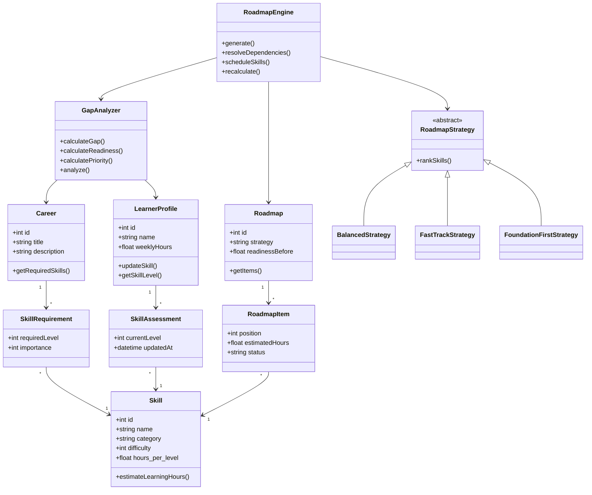
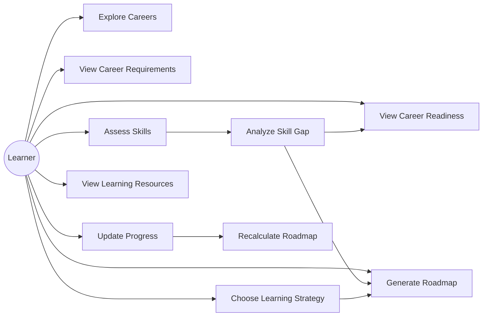
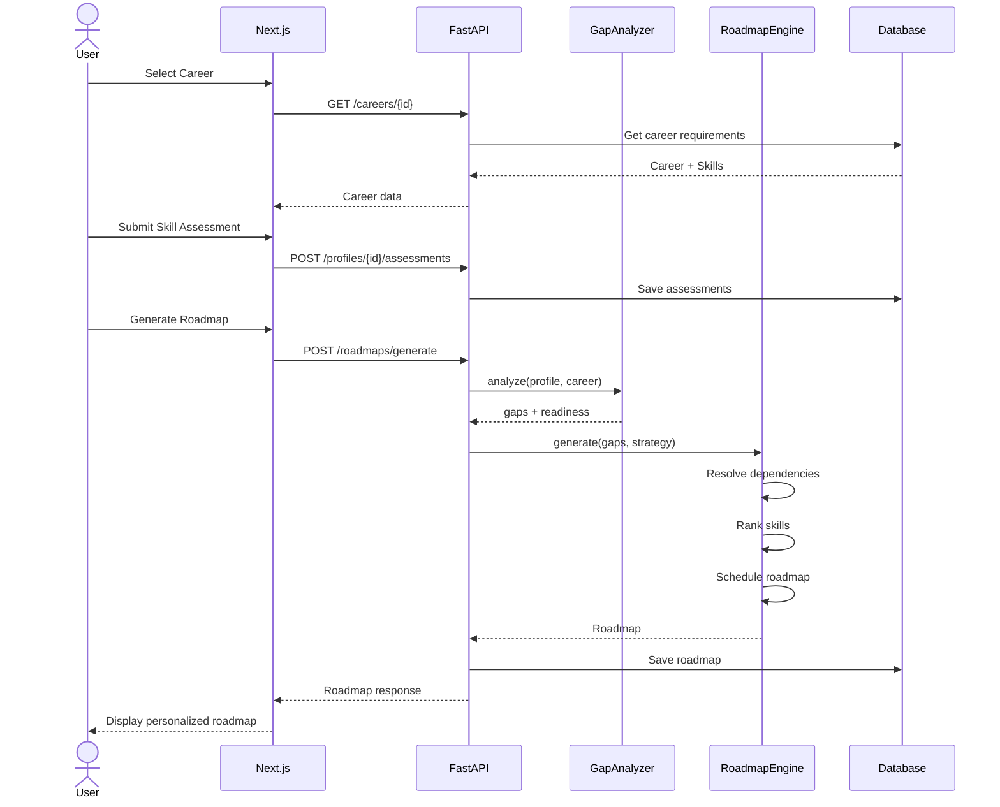

# SkillPath

### Personalized Career Readiness & Learning Roadmap System

> **“Know where you are. See what you're missing. Build the path to where you want to go.”**

แก่นของระบบไม่ใช่แค่ “เลือกอาชีพแล้วดูว่าขาด Skill อะไร” แต่ให้ Backend วิเคราะห์ **Career Readiness → Skill Gap → Skill Dependency → Priority → Learning Roadmap → Progress → Recalculation** อัตโนมัติ

แบบนี้จะดูเป็น **Software Engineering / OOAD / OOP project จริง** และยังไม่ใหญ่เกินทำเป็น Mini Project ด้วย Next.js + Python

---

# 1. Problem Statement

ปัญหาหลักของนักศึกษาหรือคนเริ่มต้นทำงานคือ:

```text
อยากเป็น Frontend Developer
        ↓
แต่ไม่รู้ว่า...
        ↓
ต้องมี Skill อะไร?
        ↓
ตอนนี้ตัวเองพร้อมแค่ไหน?
        ↓
Skill ไหนควรเรียนก่อน?
        ↓
ควรเรียนตามลำดับอะไร?
        ↓
ต้องใช้เวลาประมาณเท่าไร?
```

ปกติผู้ใช้จะเห็น Roadmap ทั่วไป เช่น

```text
HTML
CSS
JavaScript
React
Next.js
Git
Testing
```

แต่ Roadmap แบบนี้เหมือนกันสำหรับทุกคน

SkillPath จะสร้าง **Personalized Roadmap**

เช่น:

```text
User A

HTML       ██████████ 90%
CSS        ████████░░ 80%
JavaScript ██████░░░░ 60%
React      ███░░░░░░░ 30%
Git        █████░░░░░ 50%
Testing    █░░░░░░░░░ 10%
```

ระบบอาจสร้าง:

```text
1. JavaScript Advanced
        ↓
2. React Fundamentals
        ↓
3. Git Workflow
        ↓
4. React Project
        ↓
5. Testing
        ↓
6. Next.js
```

แทนที่จะบอกให้กลับไปเรียน HTML ตั้งแต่ต้น

---

# 2. เป้าหมายของระบบ

SkillPath มีเป้าหมาย 4 อย่าง

**Assess**

วิเคราะห์ Skill ปัจจุบันของผู้ใช้

**Compare**

เปรียบเทียบกับ Skill Requirement ของ Career

**Analyze**

คำนวณ Skill Gap และ Career Readiness

**Plan**

สร้าง Learning Roadmap ที่เหมาะกับผู้ใช้

Flow หลัก:

```text
Career
   ↓
Skill Requirements
   ↓
User Skill Assessment
   ↓
Gap Analysis
   ↓
Priority Analysis
   ↓
Dependency Analysis
   ↓
Roadmap Generation
   ↓
Progress Tracking
   ↓
Roadmap Recalculation
```

---

# 3. Target User

Primary target:

> นักศึกษามหาวิทยาลัย / First Jobber ที่รู้ว่าอยากทำอาชีพอะไร แต่ไม่รู้ว่าตัวเองยังขาดทักษะใด

ตัวอย่าง Career ใน Demo ไม่จำเป็นต้องเยอะ

ผมแนะนำ 5 Career:

```text
Frontend Developer
Backend Developer
UI/UX Designer
Data Analyst
Digital Marketer
```

ประมาณนี้เพียงพอสำหรับโปรเจกต์

ไม่ควรทำ 100 อาชีพ เพราะจะเสียเวลาไปกับ Dataset มากกว่าตัวระบบ

---

# 4. Scope ที่ผมแนะนำ

สำหรับ Version ส่งอาจารย์ ให้มี **6 Core Features**

| Feature            | หน้าที่                         |
| ------------------ | ------------------------------- |
| Career Explorer    | ดู Career และ Skill Requirement |
| Skill Assessment   | ประเมิน Skill ตัวเอง            |
| Career Readiness   | คำนวณความพร้อม                  |
| Skill Gap Analysis | วิเคราะห์ Skill ที่ยังขาด       |
| Smart Roadmap      | สร้างลำดับการเรียน              |
| Progress Tracker   | อัปเดต Skill แล้วคำนวณใหม่      |

ไม่จำเป็นต้องมี Login

สามารถสร้าง

```text
Learner Profile
```

เป็น Profile ภายในระบบแทน Authentication

ดังนั้น Login จะไม่ถูกนับเป็นหนึ่งใน Class OOAD ของเราอยู่แล้ว

---

# 5. User Journey

สมมติผู้ใช้เข้าระบบ

## Step 1 — Explore Careers

หน้าแรก:

```text
What career are you aiming for?

[ Frontend Developer ]
[ Backend Developer  ]
[ Data Analyst       ]
[ UI/UX Designer     ]
```

เลือก:

```text
Frontend Developer
```

---

# 6. Career Detail

แสดงรายละเอียด

```text
Frontend Developer

Build interactive and responsive
web applications.

Core Skills

HTML          Required: 4/5
CSS           Required: 4/5
JavaScript    Required: 5/5
React         Required: 4/5
Git           Required: 3/5
Testing       Required: 3/5
Next.js       Required: 3/5
```

จากนั้น

```text
[ Assess My Skills ]
```

---

# 7. Skill Assessment

ให้ผู้ใช้ประเมินตัวเองระดับ 0–5

```text
HTML

Beginner               Advanced
0   1   2   3   4   5
                ●


JavaScript

0   1   2   3   4   5
        ●


React

0   1   2   3   4   5
    ●
```

ความหมาย:

```text
0 = Never learned
1 = Basic awareness
2 = Beginner
3 = Intermediate
4 = Proficient
5 = Advanced
```

---

# 8. Career Readiness Dashboard

หลัง Submit

ระบบ Python วิเคราะห์และแสดง

```text
Frontend Developer

Career Readiness

          57%

███████████░░░░░░░
```

พร้อม Skill Breakdown

```text
HTML
Current 4 / Required 4
✓ Ready

CSS
Current 3 / Required 4
△ Small Gap

JavaScript
Current 2 / Required 5
⚠ Critical Gap

React
Current 1 / Required 4
⚠ Critical Gap

Git
Current 2 / Required 3
△ Small Gap
```

---

# 9. Readiness Algorithm

อันนี้เป็น Business Logic สำคัญของโปรเจกต์

แต่ละ Skill มี

```text
required_level
importance
```

เช่น:

```text
JavaScript

required_level = 5
importance = 5
```

React:

```text
required_level = 4
importance = 5
```

Git:

```text
required_level = 3
importance = 3
```

สูตร:

```text
Skill Readiness =
min(Current Level / Required Level, 1)
```

จากนั้น

```text
Career Readiness =

Σ(Skill Readiness × Importance)
──────────────────────────────── × 100
       Σ Importance
```

ตัวอย่าง:

```text
JavaScript

Current = 2
Required = 5

2 / 5 = 0.40

Importance = 5

Weighted Score
= 0.40 × 5
= 2
```

รวมทุก Skill แล้วแปลงเป็น %

---

# 10. Skill Gap

สูตรง่ายมาก:

```text
Gap =
max(Required Level - Current Level, 0)
```

ตัวอย่าง:

```text
JavaScript

Required = 5
Current = 2

Gap = 3
```

React:

```text
Required = 4
Current = 1

Gap = 3
```

HTML:

```text
Required = 4
Current = 5

Gap = 0
```

ดังนั้น HTML ไม่ต้องอยู่ใน Roadmap

---

# 11. Priority Algorithm

แค่ Gap อย่างเดียวยังไม่พอ

เพราะ

```text
Testing gap = 3
JavaScript gap = 3
```

ไม่ได้หมายความว่าควรเรียน Testing ก่อน JavaScript

เราจะเพิ่ม

```text
Importance
Dependency
Gap
```

สูตรตัวอย่าง:

```text
Priority Score =

Gap
× Importance
× Dependency Factor
```

เช่น JavaScript:

```text
Gap = 3
Importance = 5
Dependency Factor = 1.3

Priority =
3 × 5 × 1.3

= 19.5
```

Testing:

```text
Gap = 3
Importance = 3
Dependency Factor = 1.0

Priority =
3 × 3

= 9
```

ดังนั้น JavaScript มาก่อน

---

# 12. จุด Advance สำคัญ: Skill Dependency Graph

Skill แต่ละตัวสามารถมี prerequisite

เช่น

```text
HTML ───────────┐
               ▼
CSS ───────→ Frontend Fundamentals

JavaScript
     │
     ▼
   React
     │
     ▼
  Next.js

JavaScript
     │
     ▼
 Testing
```

เช่น:

```text
React
requires
JavaScript >= 3
```

Next.js:

```text
Next.js
requires
React >= 3
```

ดังนั้นต่อให้ Priority ของ Next.js สูง

ระบบก็ห้ามสร้าง

```text
Next.js
↓
React
↓
JavaScript
```

ต้องเป็น

```text
JavaScript
↓
React
↓
Next.js
```

นี่จะทำให้โปรเจกต์ดู Advance ขึ้นเยอะมาก

---

# 13. Roadmap Engine

RoadmapEngine จะรับ

```text
Career
User Skills
Skill Gaps
Dependencies
Weekly Study Hours
Learning Strategy
```

แล้วสร้าง

```text
Personalized Roadmap
```

ตัวอย่าง:

```text
Career
Frontend Developer

Study Time
8 hours/week
```

ผล:

```text
PHASE 1
Foundation

Week 1
JavaScript Fundamentals

Week 2
JavaScript Advanced


PHASE 2
Framework

Week 3
React Fundamentals

Week 4
React Components & State

Week 5
React Mini Project


PHASE 3
Development Workflow

Week 6
Git & GitHub


PHASE 4
Advanced

Week 7
Testing Fundamentals

Week 8
Next.js Fundamentals
```

---

# 14. เพิ่ม OOP ให้ชัดด้วย Strategy Pattern

นี่คือจุดที่ผมแนะนำมาก

ให้ผู้ใช้เลือก Learning Style

```text
Balanced
Fast Track
Foundation First
```

Backend มี abstract class

```python
RoadmapStrategy
```

แล้ว implement เป็น

```text
BalancedStrategy

FastTrackStrategy

FoundationFirstStrategy
```

แนวคิด:

```text
             RoadmapStrategy
                    ▲
          ┌─────────┼─────────┐
          │         │         │
       Balanced   Fast     Foundation
       Strategy   Track      First
```

นี่แสดง **Inheritance + Polymorphism** แบบชัดเจนมาก

---

# 15. ความแตกต่างของ Strategy

### Balanced

พิจารณา

```text
Gap
Importance
Prerequisite
Difficulty
```

เหมาะกับ Default

### Fast Track

เน้น

```text
Critical Skills
+
Minimum requirements
```

ให้พร้อมสมัครงานเร็วที่สุด

### Foundation First

เน้น prerequisite ก่อน

```text
JavaScript
↓
React
↓
Next.js
```

แม้ Skill อื่น Priority สูงกว่า

---

# 16. OOAD Domain Model

ผมแนะนำให้มี Domain Classes หลักดังนี้

```text
Skill

Career

SkillRequirement

LearnerProfile

SkillAssessment

LearningResource

Roadmap

RoadmapItem

GapAnalyzer

RoadmapEngine

RoadmapStrategy
```

ไม่จำเป็นต้องเอาทุกอันไปบอกว่าเป็น “3 Classes”

เราเกิน Requirement ไปมากแล้วครับ

---

# 17. Class Responsibilities

### Skill

แทนทักษะหนึ่งอย่าง

```text
Skill
------------------------
id
name
description
category
difficulty
hours_per_level
```

Methods:

```text
get_prerequisites()
estimate_learning_hours()
```

---

### Career

แทนอาชีพเป้าหมาย

```text
Career
------------------------
id
title
description
category
requirements[]
```

Methods:

```text
add_requirement()
get_required_skills()
```

---

### SkillRequirement

เชื่อม Career กับ Skill

```text
SkillRequirement
------------------------
skill
required_level
importance
```

---

### LearnerProfile

ข้อมูลผู้เรียน

```text
LearnerProfile
------------------------
id
name
weekly_hours
target_career
assessments[]
```

Methods:

```text
update_skill()
set_target_career()
get_skill_level()
```

---

### GapAnalyzer

นี่คือ Business Logic

```text
GapAnalyzer
------------------------

calculate_gap()

calculate_readiness()

calculate_priority()

analyze()
```

---

### RoadmapEngine

สร้าง Roadmap

```text
RoadmapEngine
------------------------

generate()

resolve_dependencies()

sort_skills()

schedule_skills()

recalculate()
```

---

# 18. OOP Concepts ที่เอาไปตอบอาจารย์ได้

โปรเจกต์นี้สามารถโชว์ OOP ได้ครบมาก

### Encapsulation

เช่น Skill level ไม่ควรแก้ตรง ๆ

แทน

```python
profile.skill_level = 999
```

ใช้

```python
profile.update_skill(skill, 4)
```

แล้ว validate ว่า

```text
0 <= level <= 5
```

---

### Abstraction

`GapAnalyzer`

ซ่อนรายละเอียดการคำนวณ

Frontend แค่ส่ง

```text
profile
career
```

แล้วเรียก

```python
analyzer.analyze(profile, career)
```

---

### Inheritance

```text
RoadmapStrategy
       ▲
       │
 ┌─────┼─────────────┐
 │     │             │
Fast Balanced Foundation
```

---

### Polymorphism

RoadmapEngine ไม่จำเป็นต้องรู้ว่า Strategy ไหน

แค่เรียก

```python
strategy.rank(skills)
```

FastTrackStrategy อาจ Rank แบบหนึ่ง

BalancedStrategy ก็อีกแบบหนึ่ง

---

# 19. Class Diagram

สามารถเอา Mermaid นี้ไปใส่ `class-diagram.md` ได้เลย



---

# 20. Use Case Diagram

Actors หลักมีแค่

```text
Learner
```

Admin ไม่จำเป็นสำหรับ Version แรก



---

# 21. Main Use Case

ตัวที่ควรเอาไปอธิบายใน Report คือ:

### Generate Personalized Roadmap

**Actor:** Learner

**Precondition:**

ผู้ใช้เลือก Career และทำ Skill Assessment แล้ว

**Flow:**

```text
1. User selects career
2. System retrieves career requirements
3. User submits skill levels
4. System calculates skill gaps
5. System calculates career readiness
6. System determines skill priority
7. System resolves prerequisites
8. System applies roadmap strategy
9. System estimates learning hours
10. System creates roadmap
11. System displays roadmap
```

---

# 22. Sequence Diagram



---

# 23. Database Design

ผมแนะนำ **PostgreSQL**

มีตารางประมาณนี้:

```text
careers
----------------
id
title
description
category


skills
----------------
id
name
description
category
difficulty
hours_per_level


career_skill_requirements
----------------
id
career_id
skill_id
required_level
importance


skill_prerequisites
----------------
skill_id
prerequisite_skill_id
minimum_level


learner_profiles
----------------
id
name
weekly_hours
target_career_id


skill_assessments
----------------
id
profile_id
skill_id
current_level
updated_at


learning_resources
----------------
id
skill_id
title
url
resource_type
difficulty
estimated_hours


roadmaps
----------------
id
profile_id
career_id
strategy
readiness_before
created_at


roadmap_items
----------------
id
roadmap_id
skill_id
position
estimated_hours
status
```

---

# 24. Database Relationships

```text
Career
  │
  └── CareerSkillRequirement
              │
              ▼
            Skill
              │
              ├── LearningResource
              │
              └── SkillPrerequisite


LearnerProfile
      │
      ├── SkillAssessment
      │
      └── Roadmap
              │
              └── RoadmapItem
```

---

# 25. REST API Design

Backend FastAPI ใช้ประมาณนี้

| Method | Endpoint                         | หน้าที่               |
| ------ | -------------------------------- | --------------------- |
| GET    | `/api/careers`                   | Career ทั้งหมด        |
| GET    | `/api/careers/{id}`              | Career detail         |
| GET    | `/api/skills`                    | Skills                |
| POST   | `/api/profiles`                  | สร้าง Learner Profile |
| GET    | `/api/profiles/{id}`             | Profile               |
| PUT    | `/api/profiles/{id}`             | Update profile        |
| POST   | `/api/profiles/{id}/assessments` | Submit assessment     |
| GET    | `/api/profiles/{id}/analysis`    | Gap analysis          |
| POST   | `/api/roadmaps/generate`         | Generate roadmap      |
| GET    | `/api/roadmaps/{id}`             | Roadmap               |
| PATCH  | `/api/roadmap-items/{id}`        | Update progress       |
| POST   | `/api/roadmaps/{id}/recalculate` | Recalculate           |
| GET    | `/api/skills/{id}/resources`     | Learning resources    |

---

# 26. ตัวอย่าง Response ของ Gap Analysis

```json
{
  "career": "Frontend Developer",
  "readiness": 57.4,
  "skills": [
    {
      "skill": "JavaScript",
      "current_level": 2,
      "required_level": 5,
      "gap": 3,
      "importance": 5,
      "priority_score": 19.5,
      "status": "critical"
    },
    {
      "skill": "React",
      "current_level": 1,
      "required_level": 4,
      "gap": 3,
      "importance": 5,
      "priority_score": 15,
      "status": "critical"
    }
  ]
}
```

---

# 27. ตัวอย่าง Roadmap API

Request:

```json
{
  "profile_id": 1,
  "career_id": 1,
  "strategy": "balanced"
}
```

Response:

```json
{
  "career": "Frontend Developer",
  "strategy": "balanced",
  "weekly_hours": 8,
  "estimated_weeks": 8,
  "steps": [
    {
      "order": 1,
      "skill": "JavaScript",
      "current_level": 2,
      "target_level": 4,
      "estimated_hours": 12
    },
    {
      "order": 2,
      "skill": "React",
      "current_level": 1,
      "target_level": 3,
      "estimated_hours": 16
    },
    {
      "order": 3,
      "skill": "Git",
      "current_level": 2,
      "target_level": 3,
      "estimated_hours": 5
    }
  ]
}
```

---

# 28. Frontend Pages

ผมจะทำประมาณ **7 Pages**

```text
/
Landing

/careers
Career Explorer

/careers/[id]
Career Detail

/assessment/[careerId]
Skill Assessment

/dashboard
Readiness Dashboard

/analysis
Skill Gap Analysis

/roadmap
Personalized Roadmap
```

ไม่ต้องแยกหน้าเยอะกว่านี้

---

# 29. Dashboard Layout

ผมมองภาพ UI ประมาณนี้

```text
┌───────────────────────────────────────────────┐
│ SkillPath                     Career Explorer │
├───────────────────────────────────────────────┤
│                                               │
│ Frontend Developer                            │
│                                               │
│ Career Readiness                              │
│                                               │
│        ╭─────────────╮                        │
│        │     57%     │                        │
│        ╰─────────────╯                        │
│                                               │
│ Critical Skill Gaps                           │
│                                               │
│ JavaScript       █████░░░░░                   │
│ React            ███░░░░░░░                   │
│ Testing          ██░░░░░░░░                   │
│                                               │
├────────────────────────┬──────────────────────┤
│ Priority Skills        │ Learning Estimate    │
│                        │                      │
│ 01 JavaScript          │ 8 Weeks              │
│ 02 React               │ 54 Hours             │
│ 03 Testing             │                      │
└────────────────────────┴──────────────────────┘
```

---

# 30. Roadmap UI

แทนที่จะทำ List ธรรมดา ใช้ Visual Timeline

```text
YOUR PATH

● JavaScript
│ Foundation
│ 12 Hours
│
● React
│ Framework
│ 16 Hours
│
● Git Workflow
│ 5 Hours
│
● Testing
│ 8 Hours
│
● Next.js
│ 12 Hours
│
★ Career Ready
```

ตรงนี้ทำ Animation ด้วย Framer Motion ได้สวยมาก

---

# 31. Visual Design Direction

จากแนวเว็บที่เหมาะกับโปรเจกต์นี้ ผมแนะนำ

**Dark Modern Career Dashboard**

```text
Background
#0C0C0E

Surface
#151518

Card
rgba(255,255,255,0.05)

Text
#F5F5F5

Muted
#A0A0AA
```

Accent ใช้เพียง 1–2 สี

เช่นฟ้า + เขียว

หลีกเลี่ยง Gradient เยอะ ๆ เพื่อไม่ให้ดู AI-generated dashboard

ส่วนสำคัญคือ

```text
Large typography
Glass panels บาง ๆ
Grid
Progress visualization
Skill graph
Timeline
Micro animation
```

---

# 32. Frontend Tech Stack

ผมเลือก:

```text
Next.js
TypeScript
App Router

Tailwind CSS

Framer Motion

Lucide Icons

Recharts
```

Next.js เองยังรองรับทั้ง App Router และ Pages Router โดยเอกสารปัจจุบันอธิบาย App Router เป็น router รุ่นใหม่ที่รองรับความสามารถ React รุ่นใหม่ ดังนั้นเริ่มโปรเจกต์ใหม่ด้วย App Router เหมาะที่สุดครับ ([Next.js][1])

---

# 33. Backend Stack

```text
Python
FastAPI

SQLAlchemy

Pydantic

PostgreSQL

pytest
```

Architecture:

```text
Controller
     ↓
Service
     ↓
Domain
     ↓
Repository
     ↓
Database
```

สำคัญมาก:

**อย่าใส่ Business Logic ไว้ใน API Route**

ไม่ควรเป็น:

```python
@app.post("/roadmap")
def generate():
    # คำนวณทุกอย่าง 200 บรรทัด
```

ควรเป็น:

```text
Route
 ↓
RoadmapService
 ↓
GapAnalyzer
 ↓
RoadmapEngine
 ↓
RoadmapStrategy
```

ตรงนี้จะทำให้ OOAD ดูดีมาก

---

# 34. Backend Folder Structure

```text
api/
│
├── index.py
│
├── core/
│   ├── config.py
│   └── database.py
│
├── models/
│   ├── skill.py
│   ├── career.py
│   ├── profile.py
│   └── roadmap.py
│
├── schemas/
│   ├── skill_schema.py
│   ├── career_schema.py
│   ├── profile_schema.py
│   └── roadmap_schema.py
│
├── domain/
│   ├── gap_analyzer.py
│   ├── roadmap_engine.py
│   └── strategies/
│       ├── base.py
│       ├── balanced.py
│       ├── fast_track.py
│       └── foundation_first.py
│
├── repositories/
│   ├── career_repository.py
│   ├── skill_repository.py
│   └── profile_repository.py
│
├── services/
│   ├── career_service.py
│   ├── assessment_service.py
│   └── roadmap_service.py
│
└── routers/
    ├── careers.py
    ├── profiles.py
    ├── assessments.py
    └── roadmaps.py
```

---

# 35. Frontend Structure

```text
app/
│
├── page.tsx
│
├── careers/
│   ├── page.tsx
│   └── [id]/
│       └── page.tsx
│
├── assessment/
│   └── [careerId]/
│       └── page.tsx
│
├── dashboard/
│   └── page.tsx
│
├── analysis/
│   └── page.tsx
│
└── roadmap/
    └── page.tsx


components/
│
├── career/
│   ├── CareerCard.tsx
│   └── CareerGrid.tsx
│
├── skill/
│   ├── SkillSlider.tsx
│   ├── SkillBar.tsx
│   └── SkillGapCard.tsx
│
├── dashboard/
│   ├── ReadinessScore.tsx
│   ├── SkillRadar.tsx
│   └── StatCard.tsx
│
└── roadmap/
    ├── RoadmapTimeline.tsx
    └── RoadmapStep.tsx
```

---

# 36. Project Structure รวม

ถ้า deploy ทั้งหมดใน Vercel:

```text
skillpath/
│
├── app/
├── components/
├── lib/
├── public/
│
├── api/
│   ├── index.py
│   ├── models/
│   ├── routers/
│   ├── services/
│   └── domain/
│
├── tests/
│
├── package.json
├── requirements.txt
└── README.md
```

Vercel มีแนวทางอย่างเป็นทางการสำหรับการวาง **Next.js frontend กับ FastAPI Python API ใน project เดียวกัน** และ deploy ใต้โดเมนเดียว โดย Python runtime ปัจจุบันยังระบุสถานะ Beta อยู่ ดังนั้นสำหรับงานมหาวิทยาลัยถือว่าเป็นตัวเลือกที่น่าสนใจมากครับ ([Vercel][2])

---

# 37. Deployment ที่ผมเลือก

## Option A — ผมแนะนำให้ลองก่อน

```text
GitHub
   │
   ▼
Vercel
   │
   ├── Next.js
   │
   └── FastAPI
          │
          ▼
      PostgreSQL
```

ข้อดีคือ URL เดียว

```text
skillpath.vercel.app

skillpath.vercel.app/api/careers
```

ง่ายตอนนำเสนอ

---

## Option B — Fallback

ถ้า Python บน Vercel มีปัญหา:

```text
Next.js
   ↓
Vercel

FastAPI
   ↓
Render

PostgreSQL
   ↓
Hosted PostgreSQL
```

Render มีคู่มือ FastAPI โดยตรง โดย build แบบ `pip install -r requirements.txt` และรัน Uvicorn ผ่าน Web Service ได้ครับ ([Render][3])

---

# 38. Dataset สำหรับ Version แรก

อย่าทำเยอะครับ

Target ที่เหมาะคือ:

```text
5 Careers

20–30 Skills

25–40 Skill Requirements

15–20 Prerequisite Relationships

30–40 Learning Resources
```

เช่น Career:

```text
Frontend Developer
Backend Developer
Data Analyst
UI/UX Designer
Digital Marketer
```

Skills:

```text
HTML
CSS
JavaScript
TypeScript
React
Next.js
Git
Testing

Python
FastAPI
SQL
REST API

Excel
SQL
Python
Statistics
Power BI

Figma
User Research
Wireframing
Prototyping

SEO
Content Marketing
Analytics
Social Media
```

---

# 39. Smart Feature ที่ควรมี

สิ่งที่จะทำให้โปรเจกต์นี้แตกต่างจาก CRUD คือ **Roadmap Recalculation**

ตัวอย่างเริ่มต้น:

```text
Readiness
57%

Roadmap:
JavaScript
React
Git
Testing
Next.js
```

ผู้ใช้เรียน JavaScript จบ

เปลี่ยน

```text
JavaScript

2 → 4
```

กด

```text
Update Progress
```

Backend วิเคราะห์ใหม่

```text
Readiness

57%
 ↓
68%
```

และ Roadmap เปลี่ยน

```text
✓ JavaScript

→ React
→ Git
→ Testing
→ Next.js
```

นี่คือ feature ที่ควรเอาไป Demo มากที่สุด

---

# 40. อีก Feature ที่น่าสนใจ: What-if Simulator

ถ้ามีเวลาค่อยเพิ่ม

ผู้ใช้เลือก:

```text
What if I study
12 hours/week?
```

ระบบตอบ:

```text
Current

8 hours/week
Estimated completion:
8 weeks


12 hours/week
Estimated completion:
5.5 weeks
```

หรือ

```text
Fast Track

Estimated:
5 weeks

Balanced

Estimated:
8 weeks
```

ทำให้ Strategy Pattern มีผลให้เห็นผ่าน UI ด้วย

---

# 41. สิ่งที่ผม “ไม่แนะนำ” ให้ใส่

เพื่อไม่ให้ Scope ระเบิด ผมจะตัดออกจาก Version แรก:

```text
❌ Login
❌ OAuth
❌ Chatbot
❌ LLM/AI API
❌ Resume parsing
❌ Job scraping
❌ LinkedIn API
❌ Real job matching
❌ Real-time collaboration
❌ Mobile App
```

SkillPath **ไม่จำเป็นต้องใช้ AI เลย**

Roadmap Engine แบบ Algorithmic จะเหมาะกับ OOAD/OOP มากกว่า และอธิบายว่าระบบตัดสินใจอย่างไรได้ชัดเจน

---

# 42. Testing

ส่วน Backend ควรมี Unit Test ชัด ๆ

ตัวอย่าง:

```text
GapAnalyzer

✓ current 2 / required 5 → gap 3

✓ current 5 / required 4 → gap 0

✓ required level cannot exceed 5

✓ readiness never exceeds 100%
```

Roadmap:

```text
✓ JavaScript comes before React

✓ React comes before Next.js

✓ completed skills are excluded

✓ critical skills receive higher priority

✓ roadmap respects weekly hours
```

Strategy:

```text
✓ FastTrack prioritizes critical requirements

✓ FoundationFirst prioritizes prerequisites

✓ Balanced uses weighted priority
```

นี่จะช่วยให้โปรเจกต์ดูแข็งแรงมากเวลาส่ง

---

# 43. MVP vs Advanced Version

ผมแนะนำให้ล็อก scope แบบนี้

### MVP — ต้องเสร็จก่อน

```text
Career Explorer

Skill Assessment

Career Readiness

Skill Gap Analysis

Roadmap Generation

Progress Update
```

### Advanced

```text
Skill Dependency Graph

3 Roadmap Strategies

Automatic Recalculation

Learning Resources

What-if Simulator

Career Comparison
```

---

# 44. Development Order

อย่าทำ Frontend ก่อนทั้งหมด

ทำตามลำดับนี้จะง่ายกว่า:

```text
Database Models
      ↓
Seed Data
      ↓
Domain Classes
      ↓
GapAnalyzer
      ↓
Unit Tests
      ↓
RoadmapEngine
      ↓
FastAPI
      ↓
API Testing
      ↓
Next.js Pages
      ↓
Dashboard
      ↓
Animations
      ↓
Deployment
```

จะช่วยกันปัญหา “UI เสร็จแต่ Backend ใช้ไม่ได้”

---

# 45. Definition ของ Project สำหรับ README

สามารถอธิบายสั้น ๆ ว่า:

> **SkillPath is a personalized career readiness and learning roadmap web application. It analyzes a learner's current skill levels against career requirements, identifies skill gaps, evaluates career readiness, resolves skill prerequisites, and generates an adaptive learning roadmap based on the learner's goals and available study time.**

---

# 46. จุดขายตอน Presentation

แทนที่จะพูดว่า

> “นี่คือเว็บแนะนำ Skill”

ควรอธิบายเป็น flow:

```text
Traditional Roadmap

Career
   ↓
Same Roadmap for Everyone
```

แต่ SkillPath:

```text
Career
 +
Current Skills
 +
Skill Importance
 +
Skill Dependencies
 +
Available Time
 +
Learning Strategy

        ↓

Personalized Roadmap
```

นี่คือ Concept หลักของโปรเจกต์เลยครับ

---

# 47. Architecture สุดท้ายที่ผมแนะนำ

```text
                    USER
                      │
                      ▼
             ┌─────────────────┐
             │     Next.js     │
             │   TypeScript    │
             │                 │
             │ Career UI       │
             │ Assessment UI   │
             │ Dashboard       │
             │ Roadmap UI      │
             └────────┬────────┘
                      │
                   REST API
                      │
                      ▼
             ┌─────────────────┐
             │     FastAPI     │
             │      Python     │
             ├─────────────────┤
             │ Router          │
             │ Service         │
             │ Repository      │
             ├─────────────────┤
             │    OOAD/OOP     │
             │                 │
             │ GapAnalyzer     │
             │ RoadmapEngine   │
             │ Strategy        │
             └────────┬────────┘
                      │
                      ▼
             ┌─────────────────┐
             │   PostgreSQL    │
             └─────────────────┘
```

## เวอร์ชันที่ผมแนะนำให้สร้างจริง

**SkillPath v1.0**

**Frontend:** Next.js + TypeScript + Tailwind + Framer Motion + Recharts
**Backend:** Python + FastAPI + SQLAlchemy + Pydantic
**Database:** PostgreSQL
**Architecture:** Controller → Service → Domain → Repository
**Core OOP:** `Skill`, `Career`, `LearnerProfile`, `GapAnalyzer`, `RoadmapEngine`, `RoadmapStrategy`
**Design Pattern:** Strategy Pattern
**Algorithms:** Weighted Readiness + Skill Gap + Priority Ranking + Dependency Resolution + Roadmap Scheduling
**Deployment:** Next.js + FastAPI บน Vercel เดียวก่อน; ถ้าติดข้อจำกัดให้ย้าย FastAPI ไป Render ซึ่งรองรับ deployment ของ FastAPI โดยตรง ([Render][3])

ด้วย scope นี้ โปรเจกต์จะ **Advance กว่า CRUD ชัดเจน**, อธิบาย **OOAD/OOP ได้ครบ**, Backend Python มีเหตุผลที่ต้องมีจริง และยังสามารถทำให้เสร็จเป็นเว็บที่ Demo ได้โดยไม่ต้องพึ่ง AI API ครับ 🔥

[1]: https://nextjs.org/docs?utm_source=chatgpt.com "Next.js Docs | Next.js"
[2]: https://vercel.com/kb/fastapi?utm_source=chatgpt.com "FastAPI | Vercel Knowledge Base"
[3]: https://render.com/docs/deploy-fastapi?utm_source=chatgpt.com "Deploy a FastAPI App – Render Docs"
